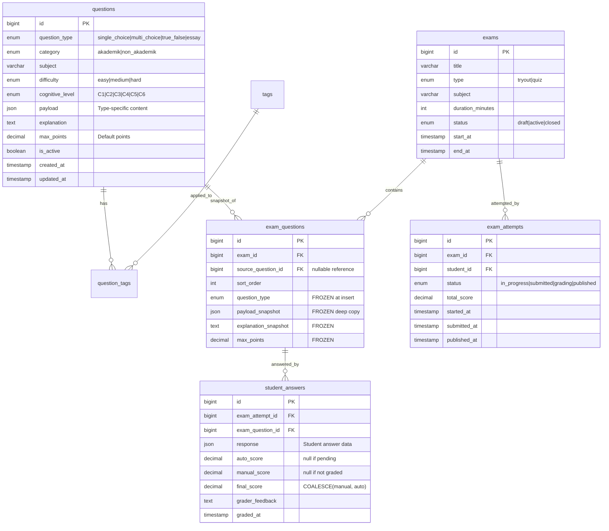
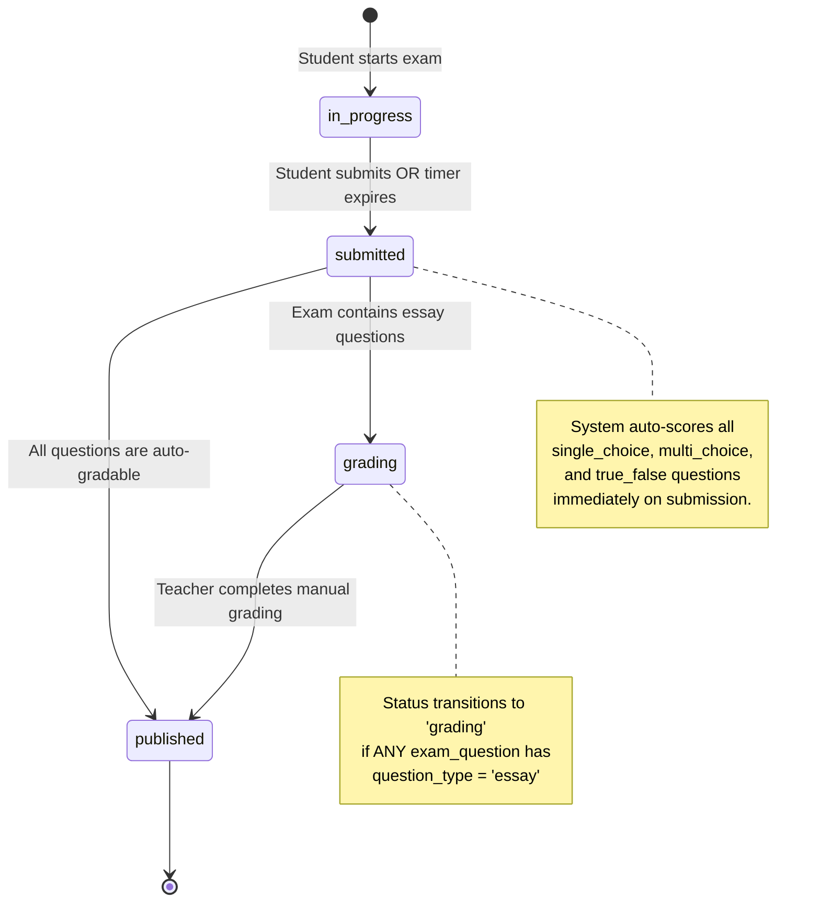
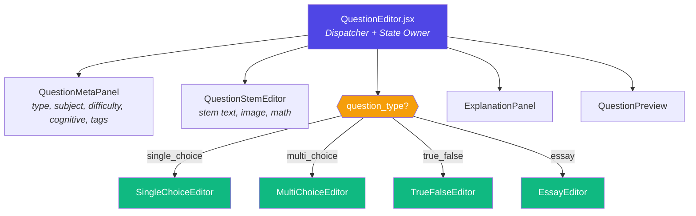

# 🏗️ Bank Soal V2 — Phase 1 Architectural Blueprint

> **System**: Portal Latihan TKA — CBT Platform  
> **Scope**: Database Schema, Scoring Engine, Frontend Architecture  
> **Status**: Awaiting Approval

---

## 1. CURRENT STATE ANALYSIS

### V1 Limitations Identified

| Area | Current State | Problem |
|------|--------------|---------|
| Question Model | Flat object: `{ text, options: {A,B,C,D}, correctAnswer: 'A' }` | Only supports single-choice with exactly 4 options |
| Data Coupling | `ExamExecution.jsx` reads directly from `mockQuestions` | No immutability — editing a question corrupts past results |
| Scoring | `userAnswer === q.correctAnswer` binary check | No partial credit, no essay support |
| Taxonomy | Only `subject` + `difficulty` (3 levels) | Missing cognitive levels, topic tags |
| Exam Status | Implicit (submitted → done) | No manual grading pipeline for essays |

### Files Impacted by This Refactor

| File | Role | Change Type |
|------|------|-------------|
| [mockQuestions.js](file:///d:/laragon/www/portal-latihan-tka-frontend/src/data/mockQuestions.js) | Question data source | **Replace** with V2 schema |
| [AddQuestion.jsx](file:///d:/laragon/www/portal-latihan-tka-frontend/src/admin/pages/AddQuestion.jsx) | Question creator (single-choice only) | **Major refactor** → Universal Builder |
| [QuestionBank.jsx](file:///d:/laragon/www/portal-latihan-tka-frontend/src/admin/pages/QuestionBank.jsx) | Bank listing & filters | **Extend** filters for type/tags |
| [ExamExecution.jsx](file:///d:/laragon/www/portal-latihan-tka-frontend/src/student/pages/ExamExecution.jsx) | Exam-taking UI | **Extend** for multi-type rendering |
| [ExamResult.jsx](file:///d:/laragon/www/portal-latihan-tka-frontend/src/student/pages/ExamResult.jsx) | Score display | **Extend** for partial scores + pending states |
| [AddTryout.jsx](file:///d:/laragon/www/portal-latihan-tka-frontend/src/admin/pages/AddTryout.jsx) | Tryout assembly | **Extend** with Copy-on-Use snapshot logic |
| [subjects.js](file:///d:/laragon/www/portal-latihan-tka-frontend/src/constants/subjects.js) | Subject constants | **Extend** with question type & cognitive enums |

---

## 2. DATABASE SCHEMA DESIGN (MySQL)

### 2.1 Core Tables — ERD Overview



### 2.2 The `questions` Table — Flexible JSON Payload

```sql
CREATE TABLE questions (
    id              BIGINT UNSIGNED AUTO_INCREMENT PRIMARY KEY,
    question_type   ENUM('single_choice', 'multi_choice', 'true_false', 'essay') NOT NULL,
    category        ENUM('akademik', 'non_akademik') NOT NULL DEFAULT 'akademik',
    subject         VARCHAR(100) NOT NULL,
    difficulty      ENUM('easy', 'medium', 'hard') NOT NULL DEFAULT 'medium',
    cognitive_level ENUM('C1', 'C2', 'C3', 'C4', 'C5', 'C6') DEFAULT 'C1',
    payload         JSON NOT NULL COMMENT 'Type-specific question content',
    explanation     TEXT NULL,
    max_points      DECIMAL(5,2) NOT NULL DEFAULT 1.00,
    is_active       BOOLEAN NOT NULL DEFAULT TRUE,
    created_by      BIGINT UNSIGNED NULL,
    created_at      TIMESTAMP DEFAULT CURRENT_TIMESTAMP,
    updated_at      TIMESTAMP DEFAULT CURRENT_TIMESTAMP ON UPDATE CURRENT_TIMESTAMP,

    INDEX idx_type_subject (question_type, subject),
    INDEX idx_difficulty (difficulty),
    INDEX idx_active (is_active)
) ENGINE=InnoDB DEFAULT CHARSET=utf8mb4;
```

### 2.3 The `exam_questions` Table — Copy-on-Use Immutability

> [!IMPORTANT]
> **This is the critical immutability layer.** When a question is pulled from the Bank into an Exam, its entire content is **deep-copied** into `payload_snapshot`. The `source_question_id` is a soft reference for traceability only — it is **NOT** used at exam time.

```sql
CREATE TABLE exam_questions (
    id                  BIGINT UNSIGNED AUTO_INCREMENT PRIMARY KEY,
    exam_id             BIGINT UNSIGNED NOT NULL,
    source_question_id  BIGINT UNSIGNED NULL COMMENT 'Traceability only, NOT used at runtime',
    sort_order          SMALLINT UNSIGNED NOT NULL DEFAULT 0,

    -- FROZEN SNAPSHOT COLUMNS (immutable after INSERT)
    question_type       ENUM('single_choice', 'multi_choice', 'true_false', 'essay') NOT NULL,
    payload_snapshot    JSON NOT NULL COMMENT 'Deep copy of questions.payload at freeze time',
    explanation_snapshot TEXT NULL,
    max_points          DECIMAL(5,2) NOT NULL DEFAULT 1.00,

    created_at          TIMESTAMP DEFAULT CURRENT_TIMESTAMP,

    FOREIGN KEY (exam_id) REFERENCES exams(id) ON DELETE CASCADE,
    INDEX idx_exam_order (exam_id, sort_order)
) ENGINE=InnoDB DEFAULT CHARSET=utf8mb4;
```

**Immutability Guarantee**: No `ON UPDATE` trigger. No `updated_at` column. Application layer enforces **INSERT-only** on this table. Laravel Model:

```php
// App\Models\ExamQuestion — Copy-on-Use enforcement
class ExamQuestion extends Model {
    public $timestamps = false; // No updated_at
    protected $guarded = ['id'];
    
    // Block all updates at the model level
    public static function boot() {
        parent::boot();
        static::updating(function ($model) {
            throw new \RuntimeException('ExamQuestion records are immutable snapshots.');
        });
    }
}
```

### 2.4 Concrete JSON `payload` Examples

#### Example A: Complex Multiple Choice (`multi_choice`)

```json
{
  "stem": "Manakah yang merupakan bilangan prima di bawah 20?",
  "stem_image": null,
  "options": [
    { "key": "A", "text": "4",  "image": null },
    { "key": "B", "text": "7",  "image": null },
    { "key": "C", "text": "11", "image": null },
    { "key": "D", "text": "15", "image": null },
    { "key": "E", "text": "13", "image": null }
  ],
  "correct_keys": ["B", "C", "E"],
  "scoring_mode": "partial",
  "penalty_for_wrong": true
}
```

> **Key differences from V1**: `correct_keys` is an **array** (not a single string). `scoring_mode` controls grading behavior. Options array is dynamic-length (not fixed A-D).

#### Example B: Essay (`essay`)

```json
{
  "stem": "Jelaskan perbedaan antara senyawa ionik dan senyawa kovalen. Berikan masing-masing 2 contoh.",
  "stem_image": null,
  "word_limit": 500,
  "rubric": [
    { "criterion": "Definisi ionik benar",  "max_points": 2.5 },
    { "criterion": "Definisi kovalen benar", "max_points": 2.5 },
    { "criterion": "Contoh ionik tepat",     "max_points": 2.5 },
    { "criterion": "Contoh kovalen tepat",   "max_points": 2.5 }
  ],
  "answer_guidelines": "Jawaban harus mencakup definisi, perbedaan ikatan, dan contoh."
}
```

#### Example C: Single Choice (`single_choice`) — V2 format

```json
{
  "stem": "Hasil dari 2.456 + 3.789 − 1.234 adalah …",
  "stem_image": null,
  "options": [
    { "key": "A", "text": "5.011", "image": null },
    { "key": "B", "text": "5.111", "image": null },
    { "key": "C", "text": "5.211", "image": null },
    { "key": "D", "text": "5.311", "image": null }
  ],
  "correct_keys": ["A"]
}
```

#### Example D: True/False (`true_false`)

```json
{
  "stem": "Matahari terbit dari arah barat.",
  "stem_image": null,
  "correct_value": false
}
```

---

## 3. SCORING ENGINE & STATE LOGIC

### 3.1 Auto-Scoring Rules by Question Type

| Type | Formula | Example |
|------|---------|---------|
| `single_choice` | `answer === correct ? max_points : 0` | Correct = 1.0 pts, Wrong = 0 |
| `true_false` | `answer === correct_value ? max_points : 0` | Same binary logic |
| `multi_choice` | **Partial credit formula below** | See §3.2 |
| `essay` | `null` (awaits manual grading) | Auto-score = `null` |

### 3.2 Complex Multiple Choice — Partial Grading Formula

```
Let:
  C = set of correct keys       (e.g., {B, C, E})
  S = set of student selections (e.g., {B, E})
  H = S ∩ C   (hits)            → {B, E}
  F = S \ C   (false positives)  → {}
  M = max_points

Score Calculation:
  Base  = (|H| / |C|) × M
  Penalty = (|F| / |C|) × M    (only if penalty_for_wrong = true)
  Final = max(0, Base - Penalty)
```

**Concrete Example**:
- Question has `correct_keys = ["B", "C", "E"]`, `max_points = 3.0`, `penalty = true`
- Student selects `["B", "E", "D"]`
- `H = {B, E}` → 2 hits, `F = {D}` → 1 false positive
- `Base = (2/3) × 3.0 = 2.0`
- `Penalty = (1/3) × 3.0 = 1.0`
- `Final = max(0, 2.0 - 1.0) = 1.0` out of 3.0

**JavaScript Implementation**:

```javascript
// utils/scoringEngine.js
export function scoreMultiChoice(payload, studentKeys, maxPoints) {
  const correctSet = new Set(payload.correct_keys);
  const studentSet = new Set(studentKeys);
  
  const hits  = [...studentSet].filter(k => correctSet.has(k)).length;
  const false_pos = [...studentSet].filter(k => !correctSet.has(k)).length;
  const total = correctSet.size;
  
  if (total === 0) return 0;
  
  const base = (hits / total) * maxPoints;
  const penalty = payload.penalty_for_wrong 
    ? (false_pos / total) * maxPoints 
    : 0;
  
  return Math.max(0, parseFloat((base - penalty).toFixed(2)));
}
```

### 3.3 Exam Attempt Status — State Machine



**Transition Logic (Laravel)**:

```php
// On student submission
public function submit(ExamAttempt $attempt) {
    $attempt->status = 'submitted';
    $attempt->submitted_at = now();
    
    // Auto-grade all non-essay questions
    $this->autoGradeAttempt($attempt);
    
    // Check if manual grading is needed
    $hasEssay = $attempt->exam->examQuestions()
        ->where('question_type', 'essay')->exists();
    
    $attempt->status = $hasEssay ? 'grading' : 'published';
    
    if (!$hasEssay) {
        $attempt->total_score = $this->calculateTotal($attempt);
        $attempt->published_at = now();
    }
    
    $attempt->save();
}
```

### 3.4 Student Answer `response` JSON Schema

```javascript
// single_choice / true_false
{ "selected": "A" }            // or { "selected": true }

// multi_choice
{ "selected": ["B", "C", "E"] }

// essay
{ "text": "Senyawa ionik adalah...", "word_count": 234 }
```

---

## 4. FRONTEND ARCHITECTURE (React/Vite)

### 4.1 Universal Question Builder — Strategy Pattern

> [!IMPORTANT]
> The core design principle: **Each question type gets its own dedicated sub-component.** The parent `QuestionEditor` acts as a **dispatcher**, not a monolith. This prevents spaghetti code.

```
src/admin/pages/
└── QuestionEditor.jsx              ← Dispatcher (replaces AddQuestion.jsx)

src/admin/components/QuestionBuilder/
├── index.js                        ← Re-exports
├── QuestionMetaPanel.jsx           ← Right sidebar: subject, difficulty, tags
├── QuestionStemEditor.jsx          ← Shared: text + image + math for stem
├── ExplanationPanel.jsx            ← Shared: explanation editor
│
├── strategies/                     ← Type-specific option editors
│   ├── SingleChoiceEditor.jsx      ← Radio + 4 option inputs (current logic)
│   ├── MultiChoiceEditor.jsx       ← Checkbox + N option inputs + correct[]
│   ├── TrueFalseEditor.jsx         ← Toggle: True/False selector
│   └── EssayEditor.jsx             ← Rubric builder + word limit config
│
└── QuestionPreview.jsx             ← Live preview of the question
```

### 4.2 Component Hierarchy & Data Flow



### 4.3 QuestionEditor.jsx — Dispatcher Blueprint

```jsx
// Pseudocode — NOT final implementation
const STRATEGY_MAP = {
  single_choice: SingleChoiceEditor,
  multi_choice:  MultiChoiceEditor,
  true_false:    TrueFalseEditor,
  essay:         EssayEditor,
};

export default function QuestionEditor() {
  const [formData, setFormData] = useState({
    question_type: 'single_choice',
    category: 'akademik',
    subject: '',
    difficulty: 'medium',
    cognitive_level: 'C1',
    payload: {},         // Shape changes per type
    explanation: '',
    max_points: 1,
    tags: [],
  });

  // Dynamic strategy selection
  const StrategyComponent = STRATEGY_MAP[formData.question_type];

  const handlePayloadChange = (newPayload) => {
    setFormData(prev => ({ ...prev, payload: newPayload }));
  };

  return (
    <Layout>
      <LeftColumn>
        <QuestionStemEditor
          stem={formData.payload.stem}
          image={formData.payload.stem_image}
          onChange={handlePayloadChange}
        />
        
        {/* This line replaces hundreds of lines of if/else */}
        <StrategyComponent
          payload={formData.payload}
          onChange={handlePayloadChange}
        />
      </LeftColumn>
      
      <RightColumn>
        <QuestionMetaPanel formData={formData} onChange={setFormData} />
        <ExplanationPanel value={formData.explanation} onChange={...} />
      </RightColumn>
      
      <SummaryBar onSave={handleSave} />
    </Layout>
  );
}
```

### 4.4 Exam Renderer — Type-Aware Components

```
src/student/components/QuestionRenderers/
├── SingleChoiceRenderer.jsx    ← Current OptionCard grid (mostly exists)
├── MultiChoiceRenderer.jsx     ← Checkbox grid with multi-select
├── TrueFalseRenderer.jsx       ← Two large True/False cards
└── EssayRenderer.jsx           ← Textarea with word counter

src/student/pages/
└── ExamExecution.jsx           ← Updated to dispatch by question_type
```

### 4.5 Updated Constants File

```javascript
// constants/questions.js (NEW)
export const QUESTION_TYPES = {
  SINGLE_CHOICE: 'single_choice',
  MULTI_CHOICE:  'multi_choice',
  TRUE_FALSE:    'true_false',
  ESSAY:         'essay',
};

export const QUESTION_TYPE_LABELS = {
  single_choice: 'Pilihan Ganda',
  multi_choice:  'Pilihan Ganda Kompleks',
  true_false:    'Benar / Salah',
  essay:         'Esai',
};

export const COGNITIVE_LEVELS = [
  { value: 'C1', label: 'C1 — Mengingat' },
  { value: 'C2', label: 'C2 — Memahami' },
  { value: 'C3', label: 'C3 — Menerapkan' },
  { value: 'C4', label: 'C4 — Menganalisis' },
  { value: 'C5', label: 'C5 — Mengevaluasi' },
  { value: 'C6', label: 'C6 — Mencipta' },
];

export const DIFFICULTY_LEVELS = [
  { value: 'easy',   label: 'Mudah' },
  { value: 'medium', label: 'Sedang' },
  { value: 'hard',   label: 'Sulit' },
];
```

---

## 5. V1 → V2 DATA MIGRATION PATH

### Mock Data Transformation

Current V1 question:
```javascript
{ id: 1, subject: 'Matematika', category: 'Akademik',
  text: 'Hasil dari 2.456 + 3.789 ...', 
  options: { A: '5.011', B: '5.111', C: '5.211', D: '5.311' },
  correctAnswer: 'A', difficulty: 'Mudah' }
```

Transforms to V2:
```javascript
{ id: 1, question_type: 'single_choice', 
  category: 'akademik', subject: 'Matematika',
  difficulty: 'easy', cognitive_level: 'C1',
  payload: {
    stem: 'Hasil dari 2.456 + 3.789 ...',
    stem_image: null,
    options: [
      { key: 'A', text: '5.011', image: null },
      { key: 'B', text: '5.111', image: null },
      { key: 'C', text: '5.211', image: null },
      { key: 'D', text: '5.311', image: null }
    ],
    correct_keys: ['A']
  },
  explanation: 'Hitung penjumlahan terlebih dahulu ...',
  max_points: 1, is_active: true }
```

---

## 6. VERIFICATION PLAN

### Automated Tests
- Unit tests for `scoringEngine.js` — all 4 question types with edge cases
- Unit tests for `ExamQuestion` model immutability guard
- Integration test: Tryout creation → snapshot verification → source edit → assert snapshot unchanged

### Manual Verification
- Build `QuestionEditor` → create one of each type → verify payload JSON
- Build exam → submit → verify `exam_questions.payload_snapshot` is frozen
- Edit source question → verify student result page shows **original** content

---

## 7. RECOMMENDED EXECUTION ORDER

| Phase | Scope | Deliverable |
|-------|-------|-------------|
| **Phase 1A** | Constants + Mock Data | `constants/questions.js` + V2 `mockQuestions.js` |
| **Phase 1B** | Scoring Engine | `utils/scoringEngine.js` with all formulas |
| **Phase 1C** | Question Builder UI | `QuestionEditor.jsx` + all strategy components |
| **Phase 1D** | Exam Renderer | Multi-type `ExamExecution.jsx` + renderers |
| **Phase 1E** | Backend Schema | Laravel migrations + models + immutability guards |
| **Phase 1F** | Grading Flow | Teacher grading UI for essays + status transitions |

---

> **Apakah blueprint arsitektur Bank Soal V2 ini sudah disetujui, dan bagian mana yang ingin dieksekusi kodenya terlebih dahulu (Skema Database/Backend atau Frontend Question Builder)?**
