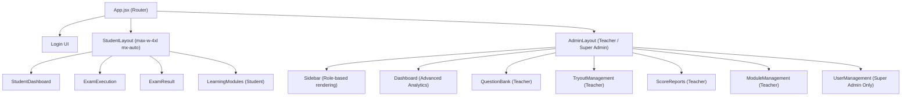

# Portal Latihan TKA — Frontend Implementation Plan (V2.0)

## Overview

Building a multi-role PWA exam portal frontend using **React 19 + Vite 8 + Tailwind CSS 3**. Moving into "Day 3" of our project development, the system now features three distinct roles and interfaces:

1. **Student Interface** — Mobile-first but desktop-optimized (centered web-app style), for taking tryout exams and consuming learning modules.
2. **Teacher Interface** — Desktop-first dashboard for managing questions, tryouts, learning modules, and viewing reports.
3. **Super Admin Dashboard** — Exclusive access to user management, along with all teacher capabilities.

> [!IMPORTANT]
> This is a **frontend-only** implementation. All data and authentication logic is mocked. No backend/API integration.

---

## Phase 1: Folder Structure & Component Tree

### Dependencies to Install (Updated)

```text
react-router-dom    — Client-side routing
lucide-react        — Modern icon library (lightweight, tree-shakable)
recharts            — Advanced charting library for analytics
```

### Proposed Folder Structure

```text
src/
├── main.jsx                          # Entry point
├── App.jsx                           # Router setup, root layout
├── index.css                         # Tailwind directives + custom design tokens
│
├── assets/                           # Static assets (images, fonts)
├── data/                             # Mock data for all views (Questions, Users, Modules, etc.)
├── hooks/                            # Custom React hooks (Timer, Network status)
│
├── auth/                             # 🔐 AUTHENTICATION
│   └── Login.jsx                     # Unified login view
│
├── student/                          # 🎒 STUDENT INTERFACE
│   ├── layouts/
│   │   └── StudentLayout.jsx         # Top nav + max-w-4xl centered wrapper
│   ├── components/                   # Student UI components
│   └── pages/
│       ├── StudentDashboard.jsx      # "Misi Minggu Ini" view
│       ├── ExamExecution.jsx         # Full exam-taking view
│       ├── ExamResult.jsx            # Post-submission summary
│       └── LearningModules.jsx       # Catalog-style module consumer
│
├── admin/                            # 👩‍🏫 TEACHER & SUPER ADMIN INTERFACE
│   ├── layouts/
│   │   └── AdminLayout.jsx           # Sidebar + main content wrapper
│   ├── components/                   # Admin UI components
│   └── pages/
│       ├── AdminDashboard.jsx        # Stats + Recharts analytics
│       ├── QuestionBank.jsx          # Teacher: Manage questions
│       ├── TryoutManagement.jsx      # Teacher: Manage tryouts
│       ├── ScoreReports.jsx          # Teacher: Student score reports
│       ├── ModuleManagement.jsx      # Teacher: Upload/manage materials
│       └── UserManagement.jsx        # Super Admin Only: Add/edit/delete users
```

### Component Tree Diagram



### Routing Map

| Path | Component | Role Access | Description |
|------|-----------|-------------|-------------|
| `/login` | `Login` | Public | Unified login interface with mock routing |
| `/` | `StudentDashboard` | Student | Student home — weekly missions |
| `/exam/:examId` | `ExamExecution` | Student | Exam taking interface |
| `/exam/:examId/result` | `ExamResult` | Student | Post-exam score summary |
| `/modules` | `LearningModules` | Student | Catalog view of study materials |
| `/teacher` | `AdminDashboard` | Teacher | Stats overview & Advanced Analytics for Teacher |
| `/admin` | `AdminDashboard` | Super Admin | Stats overview & Advanced Analytics for Admin |
| `/admin/question-bank` | `QuestionBank` | Teacher / Super Admin | Manage questions |
| `/admin/tryout` | `TryoutManagement` | Teacher / Super Admin | Manage tryout sessions |
| `/admin/reports` | `ScoreReports` | Teacher / Super Admin | View student scores |
| `/admin/modules` | `ModuleManagement` | Teacher / Super Admin | Manage learning materials |
| `/admin/users` | `UserManagement` | Super Admin | Manage Student and Teacher accounts |

> [!NOTE]
> Based on mock login credentials, Students are routed to `/`, Teachers to `/teacher` (with limited sidebar), and Super Admins to `/admin` (with full sidebar including User Management).

---

## Design System (Tailwind Config Tokens)

### Color Palette

| Token | Hex | Usage |
|-------|-----|-------|
| `primary` | `#6C5CE7` | Primary actions, highlights |
| `primary-dark` | `#5A4BD1` | Hover/active states |
| `secondary` | `#00CEC9` | Success states, accents |
| `surface` | `#F8F9FE` | Page background (light) |
| `dark` | `#1E1E2E` | Admin sidebar, dark mode backgrounds |

---

## Build Phases (Execution Order)

### Phase 2: Student Exam Execution View ⭐ (Completed/Refinement needed)
- `ExamExecution.jsx` & inner components.
- Establish responsive foundation for inner layouts.

### Phase 3: Student Dashboard View (Completed/Refinement needed)
- `StudentDashboard.jsx` & layout scaffolding.

### Phase 4: Teacher / Admin Dashboard Structure (Completed/Refinement needed)
- Scaffold `AdminLayout.jsx` and collapsible `Sidebar.jsx`.
- Implement `QuestionBank.jsx`, `TryoutManagement.jsx`, and `ScoreReports.jsx`.

### Phase 5: Initial Polish
- Ensure `lucide-react` icons are standard.
- Enforce responsive Tailwind classes (`md:`, `lg:`) on all layouts.
- Basic system-wide Dark Mode implementation.

### Phase 6: System Expansions (Auth, Roles, & Learning Modules) 🚀 NEW
- **Unified Login UI**: Create public `/login` route featuring a modern login interface. Implement mock routing logic directing users based on dummy credentials (Students -> `/`, Teachers -> `/teacher`, Super Admins -> `/admin`).
- **Role Separation & User Management**: Separate the Admin role. Teachers handle Tryouts, Questions, Reports, and Modules. Super Admins get an exclusive `UserManagement.jsx` view to add/edit/delete Student and Teacher accounts.
- **Learning Modules**: Add a "Learning Modules" ecosystem.
  - *Teacher/Admin*: `ModuleManagement.jsx` to upload/manage study materials (text, video links, PDFs).
  - *Student*: `LearningModules.jsx` as a catalog-style view to browse and consume materials.

### Phase 7: UX Polish & Analytics Upgrade ✨ NEW
- **Advanced Analytics (Recharts)**: Upgrade the `AdminDashboard.jsx` stats:
  1. **Bar Chart**: Comparing average scores between classes (e.g., Class 6A vs 6B).
  2. **Leaderboard UI**: Displaying top-scoring students and most active users.
  3. **Radar/Line Chart**: Visualizing the overall average score per subject.
- **Desktop Optimization for Students**: Resolve the issue where the Student UI is too mobile-centric and stretched on large screens. Mandate structural rules (e.g., `max-w-4xl mx-auto`) to ensure the Student Dashboard and Exam View appear as a centered, professional web-app on desktop monitors.
- **Dark Mode Bug Fixes**: Execute a strict auditing phase to fix incomplete dark mode. Enforce `dark:` variants on ALL deeply nested components (backgrounds, modals, option cards, question grid), especially within the `ExamExecution` view.

---

## Verification Plan

### Automated Tests
- `npm run build` — Ensure zero build errors.
- Visual inspection checking Recharts rendering.

### Manual Verification
- Testing user separation routing in `/login`.
- Verify Super Admin sees "User Management", but Teacher does not.
- Verify Student Interface applies `max-w-[896px] mx-auto` on wide desktop screens.
- Toggle dark mode while inside an active exam (`/exam/:id`) and verify options/modals shift correctly.

---

## Open Questions

> [!IMPORTANT]
> 1. Do we want standard dummy credentials provided on the Login screen so users don't have to guess? (e.g. "Use student/123 for Student").
> 2. For Learning Modules, should video links embed directly via an `<iframe>` or simply link outwards into a new tab?
