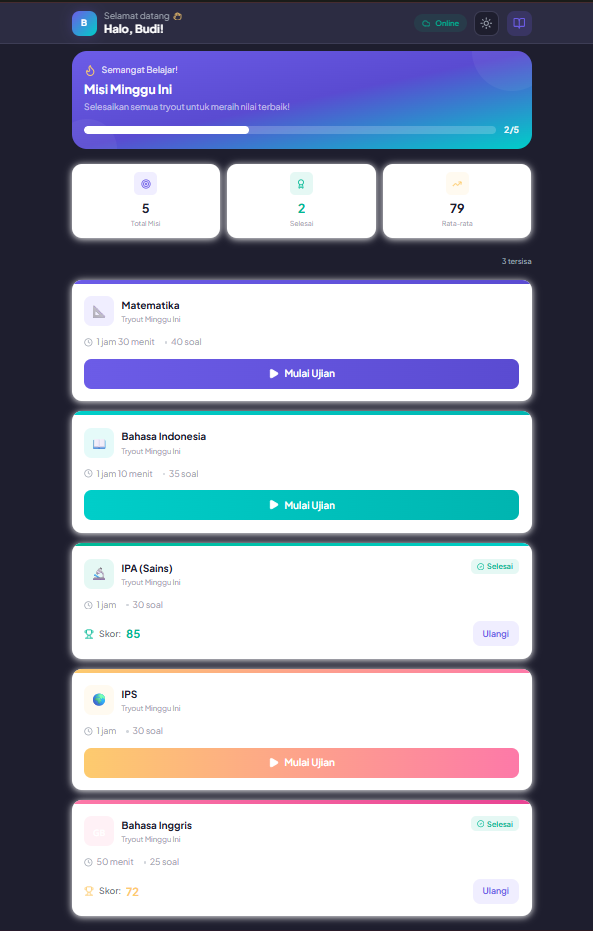
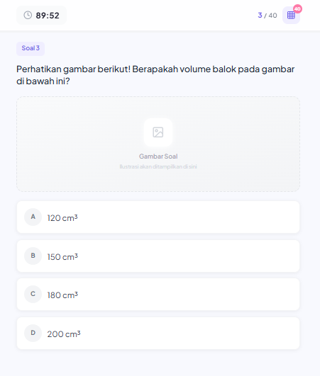
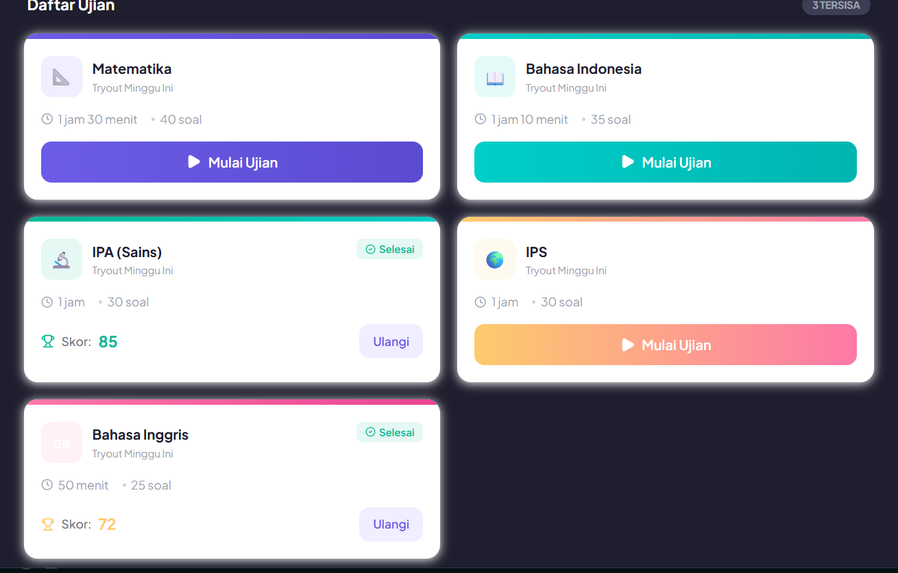
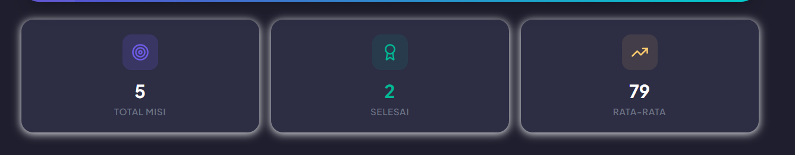
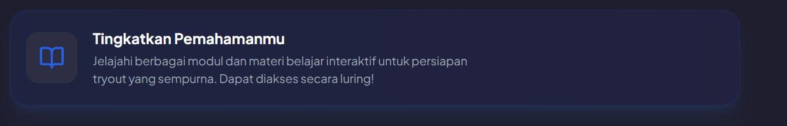
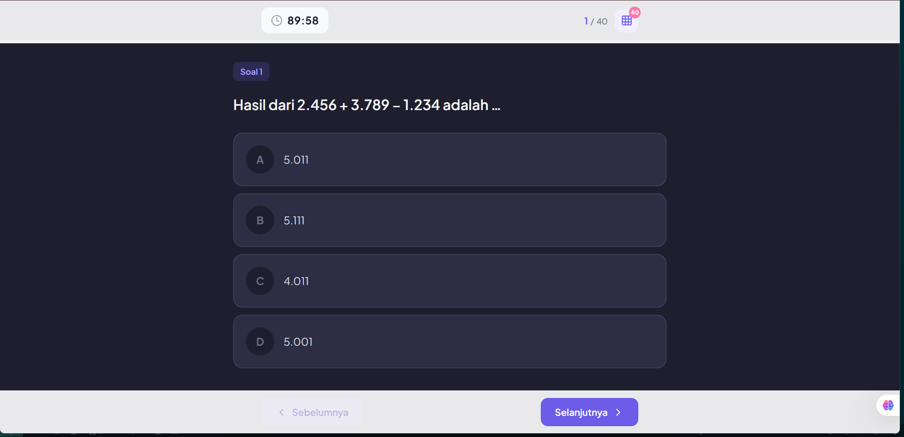

Plan dan notes Hari ke - 3 | 3 april 2026 membuat aplikasi berbasis pwa

- tampilan dark mode bagian siswa belum sempurna, masih ada warna terang
- buat fitur login
- tampilan statistik di bagian admin kurang bagus, masih banyak kekurangan, saran tampilan statistik lainnya : 	perbandingan jumlah nilai kelas 6a dan 6b, siswa peraih nilai tertinggi, siswa yang paling sering mengakses website, rata rata nilai keseluruhan per mata pelajaran.
- fitur modul belajar bagi kedua users
- tambahin user admin, yang admin sebelumnya diubah jadi guru
- tugas admin bisa nambahin akun murid dan guru (buat tampilannya dulu fitur logic nya belakangan)
- buat tampilan versi desktop untuk siswa
- bagian dalam saat melakukan test pun belum di buat dark mode, walaupun sudah mengaktifkan darkmode di awal dashboard siswa

bukti poin ke 1

bukti poin ke 8

Hiraukan notes di atas, fokus pada notes terbaru

notes terbaru pasca phase 7 selesai - 5 april 2026

- dari bagian siswa :
  - dashboardnya belum ada tampilan untuk desktop, hanya tersedia untuk mobile saja, masalah dark mode pada siswa juga belum diselesaikan seperti yang saya sebut pada notes sebelumnya.
- bagian admin/teacher :
  - pada bagian bank soal tampilannya tidak tersusun rapih, saya ingin soal di pisah sesuai dengan mata pelajarannya.
  - masih pada bagian bank soal, kalau bisa.. tambahkan fitur import pdf atau word untuk generate soal.
  - pada bagian manajemen pengguna pun tambahkan fitur import csv atau excell
  - pada bagian materi belajar juga dashboardnya kurang terstruktur, saya mau setiap materi harus tersusun rapi sesuai dengan mata pelajarannya
  - buat tampilan dashboard utama pada chart Pemetaan Kemampuan Siswa, chartnya diubah jadi pie chart aja.
- bagian login :
  - tampilan login kurang interaktif dan responsif, kayak dikhususkan untuk tampilan mobile aja, buat juga tampilan untuk desktopnya, tambahin juga tombol dark mode

new notes - 6 april 2026

halaman siswa masih punya masalah yang sama seperti sebelumnya yaitu dark mode yang kurang merata.

buktinya :

Shadow box nya tolong diganti juga, kurang enak dilihat, seharusnya warna hitam saja, kalau mau ada efek hover pada shadow box nya pakai warna yang agak gelap.

contohnya pada bagian ini

pada bagian tes juga dark mode nya ga merata

