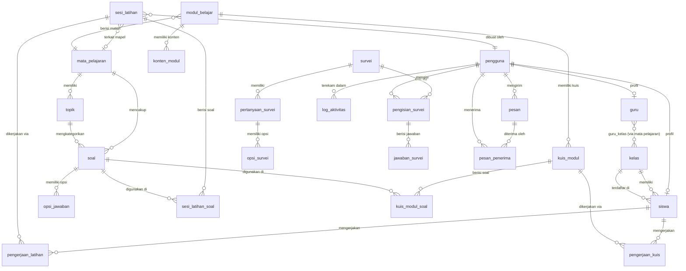

# Analisis Database — Portal Latihan TKA

> **Dipersiapkan oleh:** Senior Software Architect & Database Engineer
> **Tanggal Analisis:** 2026-06-09
> **Konteks:** Aplikasi latihan TKA untuk siswa SD Kelas 6 (Laravel + MySQL)
> **Scope Review:** 20 tabel yang teridentifikasi dari ERD diagram

---

## Ringkasan Analisis

Database ini dirancang untuk mendukung aplikasi latihan TKA (Tes Kemampuan Akademik) dengan fitur manajemen pengguna, bank soal, modul belajar, kuis, simulasi latihan, survei, notifikasi, dan log aktivitas. Secara keseluruhan struktur sudah mencakup domain yang diperlukan, namun terdapat **sejumlah masalah kritis** berupa redundansi kolom, inkonsistensi desain, pelanggaran normalisasi (khususnya 1NF dan 2NF), serta ketidakjelasan relasi antar tabel yang dapat menyebabkan data integrity issue dan maintainability yang buruk di masa depan.

**Skor Kualitas Saat Ini: 5.5 / 10**

| Aspek                 | Status                                           |
| --------------------- | ------------------------------------------------ |
| Normalisasi           | ⚠️ Parsial (ada redundansi signifikan)         |
| Konsistensi Penamaan  | ⚠️ Tidak konsisten                             |
| Integritas Relasional | ❌ Banyak FK implisit, tidak terdefinisi         |
| Tipe Data             | ⚠️ Beberapa tidak optimal                      |
| Skalabilitas          | ❌ Lemah (tabel survei & soal duplikasi pattern) |
| Audit Trail           | ⚠️ Tidak standar                               |

---

## Kelebihan Struktur Saat Ini

1. **Pemisahan concern yang baik** — Tabel `pengguna` dipisah dari `guru` dan `siswa` sebagai tabel profil (pola tabel tipe tunggal / single-table inheritance yang benar).
2. **Penggunaan tabel relasi junction** — `soal_sesi_latihan` sebagai bridge table antara `soal` dan `sesi_latihan` adalah pendekatan yang benar untuk relasi M:N.
3. **Ada tabel `log_aktivitas`** — Niat audit trail sudah ada meskipun implementasinya lemah.
4. **Status enum pada soal** — `status ENUM('draft','aktif','arsip')` pada tabel `soal` sudah merepresentasikan lifecycle soal dengan baik.
5. **Tabel kelas terpisah** — `kelas` dipisah dengan `tahun_ajaran` yang memungkinkan reuse data kelas antar tahun.
6. **Pembahasan soal tersimpan** — `pembahasan_soal_text` dan `pembahasan_soal_foto` pada `soal` mendukung fitur review jawaban.

---

## Kekurangan Struktur Saat Ini

### 🔴 KRITIS

#### 1. Redundansi Data Masif pada Domain Survei

Tabel `soal_survei` menyimpan `jenis_soal`, `isi_soal`, `opsi_jawaban`, `status` — ini **menduplikasi** kolom yang sudah ada di tabel `soal`. Desain ini memaksa pemeliharaan dua tempat untuk logika soal yang serupa.

```
soal          → isi_soal, foto_soal, pembahasan_soal_text ...
soal_survei   → jenis_soal, isi_soal, opsi_jawaban ...  ← DUPLIKASI
soal_kuis_modul → soal, opsi_jawaban, kunci_jawaban, pembahasan_soal  ← DUPLIKASI ke-3
```

**Ini adalah pelanggaran DRY (Don't Repeat Yourself) di level database.**

#### 2. `soal_kuis_modul` Bukan Junction Table — Ini Tabel Soal Ke-3

Tabel `soal_kuis_modul` menyimpan konten soal (`soal`, `opsi_jawaban`, `kunci_jawaban`, `pembahasan_soal`) secara langsung, bukan mereferensikan `id_soal`. Ini berarti soal yang sama harus diinputkan ulang jika dipakai di kuis dan di latihan mandiri. **Tidak ada single source of truth untuk soal.**

#### 3. `jawaban_siswa` dan `jawaban_kuis_siswa` Duplikasi Pattern

Dua tabel ini melayani tujuan yang hampir sama (merekam jawaban siswa), namun tidak terhubung ke tabel `soal` secara konsisten:

- `jawaban_siswa` → referensi `id_jawaban` (dari `opsi_jawaban`?)
- `jawaban_kuis_siswa` → referensi `id_kuis_modul` dan menyimpan `kunci_jawaban` secara langsung (denormalisasi)

#### 4. `jenis_pengerjaan` pada `riwayat_pengerjaan` Tidak Jelas

Kolom `jenis_pengerjaan` (VARCHAR?) dan `id_referensi` adalah pola polymorphic association yang **sangat rawan error** karena tidak ada FK constraint yang bisa di-enforce oleh database engine. Tidak ada cara untuk memastikan `id_referensi` selalu valid.

#### 5. Tabel `notifikasi` Redundan dengan `pesan_pemberitahuan`

- `pesan_pemberitahuan`: memiliki `judul`, `urgensi`, `deskripsi`, `dikirim_ke`, `created_by`
- `notifikasi`: memiliki `id_pesan`, `id_pengguna`, `id_pengirim`, `pesan`

Kedua tabel ini melayani fungsi yang sama (sistem notifikasi), namun dengan desain yang tumpang tindih. `notifikasi.id_pesan` mungkin mereferensikan `pesan_pemberitahuan`, namun relasi ini tidak eksplisit.

---

### 🟡 SIGNIFIKAN

#### 6. Inkonsistensi Penamaan Kolom PK

| Tabel              | Nama PK                       |
| ------------------ | ----------------------------- |
| pengguna           | `id_pengguna`               |
| soal               | `id_soal`                   |
| sesi_latihan       | `id_sesi_latihan` (panjang) |
| soal_kuis_modul    | `id_soal_kuis`              |
| riwayat_pengerjaan | `id_pengerjaan`             |

Tidak ada konvensi tunggal. Sebaiknya: semua PK menggunakan pola `id` (auto) atau `{nama_tabel}_id` secara konsisten.

#### 7. `sesi_latihan` Tidak Terhubung ke `siswa`

Tabel `sesi_latihan` memiliki `id_kategori`, `id_mapel`, `created_by`, dan `status`, namun **tidak ada referensi ke `id_siswa`**. Tidak jelas siapa yang mengerjakan sesi ini — guru yang membuat template sesi, atau siswa yang memulai pengerjaan?

#### 8. `sesi_kuis` Tidak Menyimpan Konteks Waktu dan Skor

Tabel `sesi_kuis` hanya memiliki `id_sesi_kuis`, `id_modul`, `id_soal_kuis`. Tidak ada `id_siswa`, `started_at`, `finished_at`, `score`. Ini membuat laporan hasil kuis tidak mungkin dibuat dari tabel ini.

#### 9. `kelas` Tidak Ada Relasi ke `mata_pelajaran`

Satu kelas biasanya memiliki banyak mata pelajaran, namun tidak ada tabel relasi `kelas_mata_pelajaran`. Guru juga direferensikan ke `kelas_id` langsung — artinya satu guru hanya boleh mengajar satu kelas, yang merupakan keterbatasan bisnis yang tidak realistis.

#### 10. `mata_pelajaran` dan `kategori_latihan` Tidak Terhubung

`soal` memiliki `id_mapel` sebagai FK ke `mata_pelajaran`, namun `sesi_latihan` memiliki `id_kategori` yang merujuk ke `kategori_latihan`. Tidak ada relasi eksplisit antara `mata_pelajaran` dan `kategori_latihan`.

#### 11. Kolom `dikirim_ke` pada `pesan_pemberitahuan` Menyimpan Nilai Multi-Value

Kolom `dikirim_ke` kemungkinan menyimpan nilai seperti `"guru,siswa"` atau `"semua"` — ini adalah **pelanggaran 1NF** (First Normal Form). Harus dipecah ke tabel relasi `pesan_penerima`.

#### 12. `survei.jenis_survei` Tidak Jelas Nilainya

Tidak ada ENUM atau FK yang mendefinisikan nilai valid untuk `jenis_survei`. Ini adalah kolom bebas yang bisa diisi sembarangan.

#### 13. `modul_belajar` Menyimpan Konten Langsung di `konten_modul`

Kolom `konten_modul` kemungkinan berisi HTML/Markdown yang sangat panjang. Untuk skalabilitas, konten modul sebaiknya dipisah ke tabel `konten_modul` atau disimpan sebagai file eksternal (S3/storage).

---

### 🟢 MINOR

#### 14. Tidak Ada `updated_at` di Sebagian Besar Tabel

Sebagian besar tabel hanya memiliki `created_at`. Tanpa `updated_at`, tidak ada cara untuk mengetahui kapan data terakhir dimodifikasi (penting untuk caching, audit, dan sync).

#### 15. `status` di Berbagai Tabel Tidak Ada Tipe Datanya yang Jelas

Banyak tabel memiliki kolom `status` tanpa definisi tipe data — apakah boolean, TINYINT, atau ENUM?

---

## Tabel yang Perlu Direvisi

| Tabel                   | Rekomendasi                                            | Alasan                                                          |
| ----------------------- | ------------------------------------------------------ | --------------------------------------------------------------- |
| `pengguna`            | ✅ Pertahankan + tambah kolom                          | Foundational table, sudah benar                                 |
| `guru`                | ✅ Pertahankan + refactor                              | Hapus `kelas_id`, pindah ke tabel pivot `guru_kelas`        |
| `siswa`               | ✅ Pertahankan + refactor                              | OK, tambah `updated_at`                                       |
| `kelas`               | ✅ Pertahankan + expand                                | Tambah relasi ke mata_pelajaran                                 |
| `mata_pelajaran`      | ✅ Pertahankan                                         | Sudah baik                                                      |
| `kategori_latihan`    | ⚠️ Gabungkan atau relasikan ke `mata_pelajaran`    | Tidak jelas hubungannya dengan mapel                            |
| `soal`                | ✅ Pertahankan sebagai**single source of truth** | Tambah `id_kategori`, jadikan master soal                     |
| `opsi_jawaban`        | ✅ Pertahankan                                         | Relasikan ke `soal` dengan benar                              |
| `soal_sesi_latihan`   | ✅ Pertahankan                                         | Junction table yang benar                                       |
| `sesi_latihan`        | ⚠️ Refactor besar                                    | Tambah `id_siswa`, `started_at`, `finished_at`, `score` |
| `soal_kuis_modul`     | ❌ Hapus + ganti dengan junction table                 | Duplikasi data soal                                             |
| `sesi_kuis`           | ⚠️ Refactor besar                                    | Tambah `id_siswa`, `started_at`, `finished_at`, `score` |
| `jawaban_kuis_siswa`  | ⚠️ Refactor                                          | Hubungkan ke `soal` bukan ke soal kuis modul                  |
| `modul_belajar`       | ✅ Pertahankan + pisah konten                          | Pisah `konten_modul` ke tabel terpisah                        |
| `riwayat_pengerjaan`  | ⚠️ Refactor                                          | Hilangkan polymorphic association, buat tabel spesifik          |
| `jawaban_siswa`       | ⚠️ Refactor                                          | Konsolidasi dengan `jawaban_kuis_siswa`                       |
| `survei`              | ✅ Pertahankan                                         | Tambah `id_pengguna`, `created_by`                          |
| `soal_survei`         | ❌ Ganti                                               | Referensikan ke master `soal` alih-alih duplikasi             |
| `jawaban_survei`      | ⚠️ Refactor                                          | Tambah `id_siswa` atau `id_pengguna`                        |
| `sesi_survei`         | ⚠️ Refactor                                          | Tambah `id_siswa`, timestamps lengkap                         |
| `pesan_pemberitahuan` | ⚠️ Refactor                                          | Pisah `dikirim_ke` ke tabel `pesan_penerima`                |
| `notifikasi`          | ⚠️ Gabungkan dengan `pesan_pemberitahuan`          | Tumpang tindih fungsi                                           |
| `log_aktivitas`       | ⚠️ Refactor                                          | Standarisasi kolom, tambah `ip_address`, `user_agent`       |

---

## Rekomendasi Struktur Database Baru

> Berikut adalah DDL SQL yang direkomendasikan untuk setiap tabel.

### 1. Manajemen Pengguna & Akses

```sql
-- MASTER PENGGUNA (tidak berubah signifikan)
CREATE TABLE pengguna (
    id_pengguna     BIGINT UNSIGNED AUTO_INCREMENT PRIMARY KEY,
    username        VARCHAR(50) NOT NULL UNIQUE,
    password_hash   VARCHAR(255) NOT NULL,
    role            ENUM('admin', 'guru', 'siswa') NOT NULL,
    status          ENUM('aktif', 'nonaktif') NOT NULL DEFAULT 'aktif',
    last_login_at   TIMESTAMP NULL,
    created_at      TIMESTAMP NOT NULL DEFAULT CURRENT_TIMESTAMP,
    updated_at      TIMESTAMP NOT NULL DEFAULT CURRENT_TIMESTAMP ON UPDATE CURRENT_TIMESTAMP
);

-- PROFIL GURU
CREATE TABLE guru (
    id_guru         BIGINT UNSIGNED AUTO_INCREMENT PRIMARY KEY,
    id_pengguna     BIGINT UNSIGNED NOT NULL UNIQUE,
    nama_lengkap    VARCHAR(100) NOT NULL,
    nip             VARCHAR(30) NULL UNIQUE,
    created_at      TIMESTAMP NOT NULL DEFAULT CURRENT_TIMESTAMP,
    updated_at      TIMESTAMP NOT NULL DEFAULT CURRENT_TIMESTAMP ON UPDATE CURRENT_TIMESTAMP,
    FOREIGN KEY (pengguna_id) REFERENCES pengguna(id) ON DELETE CASCADE
);

-- PROFIL SISWA
CREATE TABLE siswa (
    id_siswa        BIGINT UNSIGNED AUTO_INCREMENT PRIMARY KEY,
    id_pengguna     BIGINT UNSIGNED NOT NULL UNIQUE,
    id_kelas        BIGINT UNSIGNED NOT NULL,
    nama_lengkap    VARCHAR(100) NOT NULL,
    nisn            VARCHAR(20) NULL UNIQUE,
    created_at      TIMESTAMP NOT NULL DEFAULT CURRENT_TIMESTAMP,
    updated_at      TIMESTAMP NOT NULL DEFAULT CURRENT_TIMESTAMP ON UPDATE CURRENT_TIMESTAMP,
    FOREIGN KEY (id_pengguna) REFERENCES pengguna(id) ON DELETE CASCADE,
    FOREIGN KEY (id_kelas) REFERENCES kelas(id) ON DELETE RESTRICT
);

-- KELAS
CREATE TABLE kelas (
    id_kelas        BIGINT UNSIGNED AUTO_INCREMENT PRIMARY KEY,
    id_guru         BIGINT UNSIGNED NOT NULL
    nama_kelas      VARCHAR(50) NOT NULL,
    tahun_ajaran    VARCHAR(9) NOT NULL,    -- format: '2025/2026'
    is_aktif        BOOLEAN NOT NULL DEFAULT TRUE,
    created_at      TIMESTAMP NOT NULL DEFAULT CURRENT_TIMESTAMP,
    updated_at      TIMESTAMP NOT NULL DEFAULT CURRENT_TIMESTAMP ON UPDATE CURRENT_TIMESTAMP,
    UNIQUE KEY uq_kelas (nama_kelas, tahun_ajaran)
);
```

### 2. Bank Soal (Single Source of Truth)

```sql
-- MATA PELAJARAN
CREATE TABLE mata_pelajaran (
    id_mapel        BIGINT UNSIGNED AUTO_INCREMENT PRIMARY KEY,
    nama_mapel      VARCHAR(100) NOT NULL UNIQUE,
    deskripsi       TEXT NULL,
    created_at      TIMESTAMP NOT NULL DEFAULT CURRENT_TIMESTAMP,
    updated_at      TIMESTAMP NOT NULL DEFAULT CURRENT_TIMESTAMP ON UPDATE CURRENT_TIMESTAMP
);

-- KATEGORI / TOPIK SOAL (digabung konsepnya, jadi sub-topik dari mapel)
CREATE TABLE topik (
    id_topik        BIGINT UNSIGNED AUTO_INCREMENT PRIMARY KEY,
    id_mapel        BIGINT UNSIGNED NOT NULL,
    nama_topik      VARCHAR(100) NOT NULL,
    deskripsi       TEXT NULL,
    created_at      TIMESTAMP NOT NULL DEFAULT CURRENT_TIMESTAMP,
    updated_at      TIMESTAMP NOT NULL DEFAULT CURRENT_TIMESTAMP ON UPDATE CURRENT_TIMESTAMP,
    FOREIGN KEY (id_mapel) REFERENCES mata_pelajaran(id_mapel) ON DELETE CASCADE
);

-- MASTER SOAL (single source of truth untuk semua konteks penggunaan soal)
CREATE TABLE soal (
    id_soal              BIGINT UNSIGNED AUTO_INCREMENT PRIMARY KEY,
    id_mapel        BIGINT UNSIGNED NOT NULL,
    id_topik        BIGINT UNSIGNED NULL,
    jenis_soal      ENUM('pilihan_ganda', 'benar_salah', 'pilihan_ganda_kompleks') NOT NULL DEFAULT 'pilihan_ganda',
    isi_soal        LONGTEXT NOT NULL,
    foto_soal       VARCHAR(255) NULL,
    pembahasan_text LONGTEXT NULL,
    pembahasan_foto VARCHAR(255) NULL,
    status          ENUM('draft', 'aktif', 'arsip') NOT NULL DEFAULT 'draft',
    dibuat_oleh     BIGINT UNSIGNED NOT NULL,   -- FK ke pengguna
    created_at      TIMESTAMP NOT NULL DEFAULT CURRENT_TIMESTAMP,
    updated_at      TIMESTAMP NOT NULL DEFAULT CURRENT_TIMESTAMP ON UPDATE CURRENT_TIMESTAMP,
    FOREIGN KEY (mapel_id) REFERENCES mata_pelajaran(id) ON DELETE RESTRICT,
    FOREIGN KEY (topik_id) REFERENCES topik(id) ON DELETE SET NULL,
    FOREIGN KEY (dibuat_oleh) REFERENCES pengguna(id) ON DELETE RESTRICT,
    INDEX idx_soal_mapel_status (mapel_id, status),
    INDEX idx_soal_topik (topik_id)
);

-- OPSI JAWABAN (untuk soal pilihan ganda)
CREATE TABLE opsi_jawaban (
    id_opsi_jawaban      BIGINT UNSIGNED AUTO_INCREMENT PRIMARY KEY,
    id_soal         BIGINT UNSIGNED NOT NULL,
    label           CHAR(1) NOT NULL,           -- 'A', 'B', 'C', 'D'
    teks_opsi       TEXT NOT NULL,
    foto_opsi       VARCHAR(255) NULL,
    is_benar        BOOLEAN NOT NULL DEFAULT FALSE,
    UNIQUE KEY uq_opsi_soal_label (soal_id, label),
    FOREIGN KEY (soal_id) REFERENCES soal(id) ON DELETE CASCADE
);
```

### 3. Sesi Latihan & Simulasi TKA

```sql
-- SESI LATIHAN (template latihan yang bisa dibuat guru atau siswa mandiri)
CREATE TABLE sesi_latihan (
    id_latihan      BIGINT UNSIGNED AUTO_INCREMENT PRIMARY KEY,
    judul           VARCHAR(200) NOT NULL,
    id_mapel        BIGINT UNSIGNED NULL,
    id_topik        BIGINT UNSIGNED NULL,
    tipe            ENUM('latihan_mandiri', 'simulasi_tka') NOT NULL,
    durasi_menit    SMALLINT UNSIGNED NULL,       -- NULL = tanpa batas waktu
    acak_soal       BOOLEAN NOT NULL DEFAULT FALSE,
    dibuat_oleh     BIGINT UNSIGNED NOT NULL,
    status          ENUM('draft', 'aktif', 'nonaktif') NOT NULL DEFAULT 'draft',
    created_at      TIMESTAMP NOT NULL DEFAULT CURRENT_TIMESTAMP,
    updated_at      TIMESTAMP NOT NULL DEFAULT CURRENT_TIMESTAMP ON UPDATE CURRENT_TIMESTAMP,
    FOREIGN KEY (id_mapel) REFERENCES mata_pelajaran(id_mapel) ON DELETE SET NULL,
    FOREIGN KEY (id_topik) REFERENCES topik(id_topik) ON DELETE SET NULL,
    FOREIGN KEY (dibuat_oleh) REFERENCES pengguna(id_pengguna) ON DELETE RESTRICT
);

-- SOAL DALAM SESI LATIHAN (junction table)
CREATE TABLE sesi_latihan_soal (
    id_soal_latihan BIGINT UNSIGNED AUTO_INCREMENT PRIMARY KEY,
    id_sesi_latihan BIGINT UNSIGNED NOT NULL,
    id_soal         BIGINT UNSIGNED NOT NULL,
    urutan          TINYINT UNSIGNED NOT NULL DEFAULT 1,
    bobot_nilai     DECIMAL(5,2) NOT NULL DEFAULT 1.00,
    UNIQUE KEY uq_sesi_soal (sesi_latihan_id, soal_id),
    FOREIGN KEY (sesi_latihan_id) REFERENCES sesi_latihan(id) ON DELETE CASCADE,
    FOREIGN KEY (soal_id) REFERENCES soal(id) ON DELETE CASCADE
);

-- PENGERJAAN SISWA UNTUK SESI LATIHAN
CREATE TABLE pengerjaan_latihan (
    id_pengerjaan   BIGINT UNSIGNED AUTO_INCREMENT PRIMARY KEY,
    id_siswa        BIGINT UNSIGNED NOT NULL,
    id_sesi_latihan BIGINT UNSIGNED NOT NULL,
    started_at      TIMESTAMP NOT NULL DEFAULT CURRENT_TIMESTAMP,
    finished_at     TIMESTAMP NULL,
    nilai           DECIMAL(5,2) NULL,
    jumlah_benar    SMALLINT UNSIGNED NULL,
    jumlah_salah    SMALLINT UNSIGNED NULL,
    status          ENUM('berlangsung', 'selesai', 'dibatalkan') NOT NULL DEFAULT 'berlangsung',
    created_at      TIMESTAMP NOT NULL DEFAULT CURRENT_TIMESTAMP,
    FOREIGN KEY (id_siswa) REFERENCES siswa(id_siswa) ON DELETE CASCADE,
    FOREIGN KEY (id_sesi_latihan) REFERENCES sesi_latihan(id_latihan) ON DELETE CASCADE,
    INDEX idx_pengerjaan_siswa (id_siswa),
    INDEX idx_pengerjaan_sesi (id_sesi_latihan)
);

-- JAWABAN SISWA PER SOAL (konsolidasi jawaban_siswa dan jawaban_kuis_siswa)
CREATE TABLE jawaban_pengerjaan (
    id_jawaban_siswa    BIGINT UNSIGNED AUTO_INCREMENT PRIMARY KEY,
    id_pengerjaan       BIGINT UNSIGNED NOT NULL,   -- FK ke pengerjaan_latihan ATAU pengerjaan_kuis
    pengerjaan_tipe     ENUM('latihan', 'kuis') NOT NULL,
    id_soal             BIGINT UNSIGNED NOT NULL,
    id_opsi_jawaban     BIGINT UNSIGNED NULL,        -- untuk pilihan ganda
    is_benar            BOOLEAN NULL,
    waktu_jawab         TIMESTAMP NOT NULL DEFAULT CURRENT_TIMESTAMP,
    FOREIGN KEY (id_soal) REFERENCES soal(id_soal) ON DELETE CASCADE
    -- Note: FK ke pengerjaan tidak bisa di-enforce karena polymorphic, 
    -- gunakan aplikasi-level validation
);
```

### 4. Modul Belajar & Kuis Modul

```sql
-- MODUL BELAJAR
CREATE TABLE modul_belajar (
    id_modul        BIGINT UNSIGNED AUTO_INCREMENT PRIMARY KEY,
    mapel_id        BIGINT UNSIGNED NOT NULL,
    id_topik        BIGINT UNSIGNED NOT NULL
    judul           VARCHAR(200) NOT NULL,
    deskripsi       TEXT NULL,
    urutan          TINYINT UNSIGNED NOT NULL DEFAULT 1,
    status          ENUM('draft', 'aktif', 'arsip') NOT NULL DEFAULT 'draft',
    dibuat_oleh     BIGINT UNSIGNED NOT NULL,
    created_at      TIMESTAMP NOT NULL DEFAULT CURRENT_TIMESTAMP,
    updated_at      TIMESTAMP NOT NULL DEFAULT CURRENT_TIMESTAMP ON UPDATE CURRENT_TIMESTAMP,
    FOREIGN KEY (id_mapel) REFERENCES mata_pelajaran(id_mapel) ON DELETE RESTRICT,
    FOREIGN KEY (id_topik) REFERENCES topik(id_topik) ON DELETE RESTRICT,
    FOREIGN KEY (dibuat_oleh) REFERENCES pengguna(id_pengguna) ON DELETE RESTRICT
);

-- KONTEN MODUL (dipisah dari modul_belajar untuk performa)
CREATE TABLE konten_modul (
    id_konten_modul BIGINT UNSIGNED AUTO_INCREMENT PRIMARY KEY,
    id_modul        BIGINT UNSIGNED NOT NULL,
    tipe_konten     ENUM('teks', 'video', 'gambar', 'file') NOT NULL DEFAULT 'teks',
    urutan          TINYINT UNSIGNED NOT NULL DEFAULT 1,
    konten          LONGTEXT NULL,          -- untuk teks/HTML
    url_media       VARCHAR(500) NULL,      -- untuk video/gambar/file
    created_at      TIMESTAMP NOT NULL DEFAULT CURRENT_TIMESTAMP,
    updated_at      TIMESTAMP NOT NULL DEFAULT CURRENT_TIMESTAMP ON UPDATE CURRENT_TIMESTAMP,
    FOREIGN KEY (id_modul) REFERENCES modul_belajar(id_modul) ON DELETE CASCADE
);

-- KUIS MODUL (template kuis yang terhubung ke modul)
CREATE TABLE kuis_modul (
    id_kuis         BIGINT UNSIGNED AUTO_INCREMENT PRIMARY KEY,
    id_modul        BIGINT UNSIGNED NOT NULL,
    judul           VARCHAR(200) NOT NULL,
    nilai_minimum   DECIMAL(5,2) NOT NULL DEFAULT 70.00,
    created_at      TIMESTAMP NOT NULL DEFAULT CURRENT_TIMESTAMP,
    updated_at      TIMESTAMP NOT NULL DEFAULT CURRENT_TIMESTAMP ON UPDATE CURRENT_TIMESTAMP,
    FOREIGN KEY (id_modul) REFERENCES modul_belajar(id_modul) ON DELETE CASCADE
);

-- SOAL DALAM KUIS MODUL (referensikan ke master soal!)
CREATE TABLE kuis_modul_soal (
    id_soal_kuis    BIGINT UNSIGNED AUTO_INCREMENT PRIMARY KEY,
    id_kuis         BIGINT UNSIGNED NOT NULL,
    id_soal         BIGINT UNSIGNED NOT NULL,
    urutan          TINYINT UNSIGNED NOT NULL DEFAULT 1,
    UNIQUE KEY uq_kuis_soal (kuis_id, soal_id),
    FOREIGN KEY (id_kuis) REFERENCES kuis_modul(id_kuis) ON DELETE CASCADE,
    FOREIGN KEY (id_soal) REFERENCES soal(id_soal) ON DELETE CASCADE
);

-- PENGERJAAN KUIS OLEH SISWA
CREATE TABLE pengerjaan_kuis (
    id_pengerjaan_kuis BIGINT UNSIGNED AUTO_INCREMENT PRIMARY KEY,
    id_siswa           BIGINT UNSIGNED NOT NULL,
    id_kuis            BIGINT UNSIGNED NOT NULL,
    started_at      TIMESTAMP NOT NULL DEFAULT CURRENT_TIMESTAMP,
    finished_at     TIMESTAMP NULL,
    nilai           DECIMAL(5,2) NULL,
    lulus           BOOLEAN NULL,
    percobaan_ke    TINYINT UNSIGNED NOT NULL DEFAULT 1,
    created_at      TIMESTAMP NOT NULL DEFAULT CURRENT_TIMESTAMP,
    FOREIGN KEY (id_siswa) REFERENCES siswa(id_siswa) ON DELETE CASCADE,
    FOREIGN KEY (id_kuis) REFERENCES kuis_modul(id_kuis) ON DELETE CASCADE,
    INDEX idx_pengerjaan_kuis_siswa (id_siswa, id_kuis)
);
```

### 5. Survei (Direvisi)

```sql
-- SURVEI
CREATE TABLE survei (
    id_survei       BIGINT UNSIGNED AUTO_INCREMENT PRIMARY KEY,
    judul           VARCHAR(200) NOT NULL,
    deskripsi       TEXT NULL,
    jenis_survei    ENUM('survei karakter', 'survei lingkungan belajar') NOT NULL,
    dibuat_oleh     BIGINT UNSIGNED NOT NULL,
    mulai_at        TIMESTAMP NULL,
    berakhir_at     TIMESTAMP NULL,
    status          ENUM('draft', 'aktif', 'ditutup') NOT NULL DEFAULT 'draft',
    created_at      TIMESTAMP NOT NULL DEFAULT CURRENT_TIMESTAMP,
    updated_at      TIMESTAMP NOT NULL DEFAULT CURRENT_TIMESTAMP ON UPDATE CURRENT_TIMESTAMP,
    FOREIGN KEY (dibuat_oleh) REFERENCES pengguna(id_pengguna) ON DELETE RESTRICT
);

-- PERTANYAAN SURVEI (menggunakan MASTER SOAL atau mandiri)
CREATE TABLE pertanyaan_survei (
    id_soal_survei  BIGINT UNSIGNED AUTO_INCREMENT PRIMARY KEY,
    id_survei       BIGINT UNSIGNED NOT NULL,
    isi_pertanyaan  TEXT NOT NULL,
    tipe_jawaban    ENUM('pilihan_ganda', 'skala_likert', 'ya_tidak') NOT NULL,
    urutan          TINYINT UNSIGNED NOT NULL DEFAULT 1,
    is_wajib        BOOLEAN NOT NULL DEFAULT TRUE,
    created_at      TIMESTAMP NOT NULL DEFAULT CURRENT_TIMESTAMP,
    FOREIGN KEY (id_survei) REFERENCES survei(id_survei) ON DELETE CASCADE
);

-- OPSI JAWABAN SURVEI
CREATE TABLE opsi_survei (
    id_opsi_survei  BIGINT UNSIGNED AUTO_INCREMENT PRIMARY KEY,
    id_soal_survei  BIGINT UNSIGNED NOT NULL,
    teks_opsi       VARCHAR(255) NOT NULL,
    nilai_opsi      TINYINT NULL,               -- untuk skala likert
    urutan          TINYINT UNSIGNED NOT NULL DEFAULT 1,
    FOREIGN KEY (id_soal_survei) REFERENCES pertanyaan_survei(id_soal_survei) ON DELETE CASCADE
);

-- SESI PENGISIAN SURVEI
CREATE TABLE pengisian_survei (
    id_pengisian_survei  BIGINT UNSIGNED AUTO_INCREMENT PRIMARY KEY,
    id_survei            BIGINT UNSIGNED NOT NULL,
    id_pengguna          BIGINT UNSIGNED NOT NULL,
    started_at           TIMESTAMP NOT NULL DEFAULT CURRENT_TIMESTAMP,
    finished_at          TIMESTAMP NULL,
    status               ENUM('berlangsung', 'selesai') NOT NULL DEFAULT 'berlangsung',
    UNIQUE KEY uq_pengisian (id_survei, id_pengguna),    -- 1 user 1x isi survei
    FOREIGN KEY (id_survei) REFERENCES survei(id_survei) ON DELETE CASCADE,
    FOREIGN KEY (id_pengguna) REFERENCES pengguna(id_pengguna) ON DELETE CASCADE
);

-- JAWABAN SURVEI
CREATE TABLE jawaban_survei (
    id_jawaban_survei   BIGINT UNSIGNED AUTO_INCREMENT PRIMARY KEY,
    id_pengisian_survei BIGINT UNSIGNED NOT NULL,
    id_soal_survei      BIGINT UNSIGNED NOT NULL,
    id_opsi_survei      BIGINT UNSIGNED NULL,
    jawaban_teks        TEXT NULL,
    created_at          TIMESTAMP NOT NULL DEFAULT CURRENT_TIMESTAMP,
    FOREIGN KEY (id_pengisian_survei) REFERENCES pengisian_survei(id_pengisian_survei) ON DELETE CASCADE,
    FOREIGN KEY (id_soal_survei) REFERENCES pertanyaan_survei(id_soal_survei) ON DELETE CASCADE,
    FOREIGN KEY (id_opsi_survei) REFERENCES opsi_survei(id_opsi_survei) ON DELETE SET NULL
);
```

### 6. Notifikasi & Pesan (Konsolidasi)

```sql
-- PESAN / NOTIFIKASI (konsolidasi pesan_pemberitahuan + notifikasi)
CREATE TABLE pesan (
    id_notifikasi   BIGINT UNSIGNED AUTO_INCREMENT PRIMARY KEY,
    judul           VARCHAR(200) NOT NULL,
    isi             TEXT NOT NULL,
    tipe            ENUM('informasi', 'peringatan', 'darurat', 'pengumuman') NOT NULL DEFAULT 'informasi',
    dikirim_oleh    BIGINT UNSIGNED NOT NULL,
    created_at      TIMESTAMP NOT NULL DEFAULT CURRENT_TIMESTAMP,
    FOREIGN KEY (dikirim_oleh) REFERENCES pengguna(id_pengguna) ON DELETE RESTRICT
);

-- PENERIMA PESAN (menggantikan kolom dikirim_ke yang multi-value)
CREATE TABLE pesan_penerima (
    id_penerima     BIGINT UNSIGNED AUTO_INCREMENT PRIMARY KEY,
    id_pesan        BIGINT UNSIGNED NOT NULL,
    id_pengguna     BIGINT UNSIGNED NOT NULL,
    dibaca_at       TIMESTAMP NULL,
    created_at      TIMESTAMP NOT NULL DEFAULT CURRENT_TIMESTAMP,
    UNIQUE KEY uq_pesan_penerima (id_pesan, id_pengguna),
    FOREIGN KEY (id_pesan) REFERENCES pesan(id_pesan) ON DELETE CASCADE,
    FOREIGN KEY (id_pengguna) REFERENCES pengguna(id_pengguna) ON DELETE CASCADE,
    INDEX idx_penerima_belum_baca (id_pengguna, dibaca_at)
);
```

### 7. Log Aktivitas (Direvisi)

```sql
-- LOG AKTIVITAS (standar audit trail)
CREATE TABLE log_aktivitas (
    id_log_aktivitas  BIGINT UNSIGNED AUTO_INCREMENT PRIMARY KEY,
    id_pengguna       BIGINT UNSIGNED NOT NULL,
    aksi              VARCHAR(100) NOT NULL,       -- 'login', 'submit_latihan', 'buka_modul', dll
    modul             VARCHAR(50) NOT NULL,        -- 'auth', 'latihan', 'kuis', 'survei', dll
    tabel_terkait     VARCHAR(50) NULL,            -- nama tabel yang diaffect
    id_terkait        BIGINT UNSIGNED NULL,        -- id record yang diaffect
    detail            JSON NULL,                  -- data tambahan yang fleksibel
    ip_address        VARCHAR(45) NULL,           -- supports IPv6
    user_agent        VARCHAR(500) NULL,
    created_at        TIMESTAMP NOT NULL DEFAULT CURRENT_TIMESTAMP,
    FOREIGN KEY (id_pengguna) REFERENCES pengguna(id_pengguna) ON DELETE CASCADE,
    INDEX idx_log_pengguna_aksi (id_pengguna, aksi),
    INDEX idx_log_created_at (created_at)
) ENGINE=InnoDB;
-- Pertimbangkan PARTITIONING BY RANGE pada created_at untuk data besar
```

---

## Relasi Antar Tabel



**Ringkasan Kardinalitas:**

| Relasi                           | Tipe |
| -------------------------------- | ---- |
| pengguna → guru                 | 1:1  |
| pengguna → siswa                | 1:1  |
| guru ↔ kelas (via guru_kelas)   | M:N  |
| siswa → kelas                   | M:1  |
| mata_pelajaran → topik          | 1:N  |
| mata_pelajaran → soal           | 1:N  |
| soal → opsi_jawaban             | 1:N  |
| sesi_latihan ↔ soal             | M:N  |
| modul_belajar → kuis_modul      | 1:N  |
| kuis_modul ↔ soal               | M:N  |
| survei → pertanyaan_survei      | 1:N  |
| pesan ↔ pengguna (via penerima) | M:N  |

---

## Rekomendasi Tipe Data SQL

| Tabel              | Kolom             | Tipe Lama                         | Tipe Rekomendasi                                          | Alasan                                              |
| ------------------ | ----------------- | --------------------------------- | --------------------------------------------------------- | --------------------------------------------------- |
| semua              | `id` / PK       | `BIGINT`                        | `BIGINT UNSIGNED AUTO_INCREMENT`                        | Positif saja, hemat ruang                           |
| pengguna           | `role`          | `ENUM('siswa','guru','admin')`  | `ENUM('admin','guru','siswa')`                          | Urutkan dari privilege tertinggi                    |
| pengguna           | `status`        | `boolean`                       | `ENUM('aktif','nonaktif','banned')`                     | Boolean terlalu terbatas, tidak support banned      |
| kelas              | `tahun_ajaran`  | `varchar`                       | `VARCHAR(9)`                                            | Format '2025/2026', cukup 9 karakter                |
| soal               | `isi_soal`      | `longtext`                      | `TEXT` atau `LONGTEXT`                                | TEXT cukup jika < 64KB, LONGTEXT untuk konten media |
| soal               | `foto_soal`     | `varchar`                       | `VARCHAR(500)`                                          | URL bisa panjang (S3 signed URL)                    |
| soal               | `created_by`    | `bigint unsigned`               | `BIGINT UNSIGNED` NOT NULL + FK                         | Harus ada FK eksplisit                              |
| soal               | `status`        | `enum('draft','aktif','arsip')` | ✅ Sudah tepat                                            | —                                                  |
| opsi_jawaban       | `jenis_jawaban` | `ENUM('pg','benar salah')`      | `ENUM('pilihan_ganda','benar_salah')`                   | Nama yang lebih deskriptif                          |
| opsi_jawaban       | `kunci_jawaban` | (tidak ada tipe)                  | `BOOLEAN`                                               | Cukup true/false untuk menandai jawaban benar       |
| sesi_latihan       | `status`        | (tidak ada tipe)                  | `ENUM('draft','aktif','nonaktif')`                      | Perlu ENUM eksplisit                                |
| riwayat_pengerjaan | `nilai`         | (tidak ada tipe)                  | `DECIMAL(5,2)`                                          | Nilai 0.00-100.00, butuh presisi desimal            |
| pengerjaan_latihan | `durasi_aktual` | (tidak ada)                       | `SMALLINT UNSIGNED`                                     | Dalam detik atau menit                              |
| log_aktivitas      | `detail`        | `keterangan` (text)             | `JSON`                                                  | Fleksibel untuk metadata aktivitas yang bervariasi  |
| log_aktivitas      | `ip_address`    | (tidak ada)                       | `VARCHAR(45)`                                           | Mendukung IPv4 (15) dan IPv6 (39)                   |
| survei             | `jenis_survei`  | `(tidak ada tipe)`              | `ENUM('kepuasan','diagnostik','minat','lainnya')`       | Perlu validasi di DB level                          |
| modul_belajar      | `konten_modul`  | (implied longtext)                | Pindah ke tabel `konten_modul` dengan `LONGTEXT`      | Performa query tabel utama                          |
| guru               | `nip`           | `varchar`                       | `VARCHAR(30) NULL UNIQUE`                               | NIP bisa NULL (guru honor), harus unik              |
| siswa              | `nisn`          | `varchar`                       | `VARCHAR(20) NULL UNIQUE`                               | NISN 10 digit, harus unik                           |
| pesan              | `tipe`          | (tidak ada)                       | `ENUM('informasi','peringatan','darurat','pengumuman')` | Level urgency yang lebih kaya                       |

---

## Risiko Desain Saat Ini

### 🔴 Risiko Kritis

| No | Risiko                                                                                                               | Dampak                                       | Mitigasi                                                     |
| -- | -------------------------------------------------------------------------------------------------------------------- | -------------------------------------------- | ------------------------------------------------------------ |
| 1  | **Data inconsistency soal** — soal yang sama ada di 3 tempat (`soal`, `soal_kuis_modul`, `soal_survei`) | Data bisa berbeda antar tabel                | Jadikan `soal` sebagai single source of truth              |
| 2  | **Tidak ada FK pada polymorphic association** (`riwayat_pengerjaan.id_referensi`)                            | Data orphan, integritas tidak terjamin       | Pisah menjadi tabel spesifik                                 |
| 3  | **`dikirim_ke` multi-value di `pesan_pemberitahuan`**                                                      | Query sangat sulit, tidak bisa di-index      | Buat tabel `pesan_penerima`                                |
| 4  | **Sesi latihan tidak terhubung ke siswa**                                                                      | Tidak bisa menampilkan history latihan siswa | Tambah `siswa_id` + tabel `pengerjaan_latihan`           |
| 5  | **Skor tidak tersimpan per pengerjaan**                                                                        | Tidak bisa membuat progress report           | Tambah kolom `nilai`, `jumlah_benar` di tabel pengerjaan |

### 🟡 Risiko Skalabilitas

| No | Risiko                                           | Proyeksi Dampak                               |
| -- | ------------------------------------------------ | --------------------------------------------- |
| 6  | `log_aktivitas` tanpa partisi                  | Di >1 juta row, query melambat drastis        |
| 7  | `konten_modul` inline di `modul_belajar`     | Full table scan ketika load list modul        |
| 8  | Tidak ada soft delete (deleted_at)               | Data terhapus permanen, tidak bisa undo       |
| 9  | Tidak ada indeks pada kolom yang sering di-WHERE | JOIN query lambat saat data bertumbuh         |
| 10 | Tidak ada `remember_token` di `pengguna`     | Session management tidak aman / tidak lengkap |

### 🟢 Risiko Maintainability

| No | Risiko                                                                                          |
| -- | ----------------------------------------------------------------------------------------------- |
| 11 | Inkonsistensi nama kolom (id_pengguna vs pengguna_id) membuat query dan ORM model membingungkan |
| 12 | Tidak ada dokumentasi ENUM value yang valid untuk kolom `status` dan `jenis`                |
| 13 | Tanpa `updated_at`, audit trail tidak bisa mendeteksi data yang dimodifikasi                  |

---

## Roadmap Implementasi Backend

### Fase 0 — Persiapan (Minggu 1)

- [ ] Finalisasi ERD revisi bersama tim
- [ ] Setup environment: Laravel 11, MySQL 8.0+, Redis (untuk queue & cache)
- [ ] Tentukan konvensi penamaan: semua tabel snake_case, semua PK `id`, semua FK `{tabel}_id`
- [ ] Setup migration baseline (bukan dump SQL mentah)
- [ ] Setup Seeder untuk data master (mata_pelajaran, kelas, admin default)

### Fase 1 — Core User Management (Minggu 1–2)

```
Migration: pengguna → guru → siswa → kelas → guru_kelas
Model:     Pengguna (HasOne Guru / HasOne Siswa)
Auth:      Laravel Sanctum / Passport untuk multi-role
Policy:    GatePolicy per role (Admin, Guru, Siswa)
```

- [ ] Migration tabel `pengguna`, `guru`, `siswa`, `kelas`, `guru_kelas`
- [ ] Setup Eloquent Model dengan relationship
- [ ] Auth: Login, Logout, Refresh Token
- [ ] Middleware role-based access

### Fase 2 — Bank Soal (Minggu 2–3)

```
Migration: mata_pelajaran → topik → soal → opsi_jawaban
Feature:   CRUD soal dengan foto upload (Laravel Storage / S3)
```

- [ ] Migration tabel `mata_pelajaran`, `topik`, `soal`, `opsi_jawaban`
- [ ] API: CRUD Soal dengan filter by mapel, topik, status, difficulty
- [ ] File upload service untuk `foto_soal` dan `pembahasan_foto`
- [ ] Seeder: Import 100 soal sample per mata pelajaran

### Fase 3 — Modul Belajar & Kuis (Minggu 3–4)

```
Migration: modul_belajar → konten_modul → kuis_modul → kuis_modul_soal
Feature:   CRUD modul, upload konten, assign soal ke kuis
```

- [ ] Migration + Model modul dan kuis
- [ ] API: CRUD Modul, Publish/Unpublish
- [ ] API: Assign soal ke kuis (dari bank soal yang sudah ada)
- [ ] API: Siswa mengerjakan kuis, simpan ke `pengerjaan_kuis` + `jawaban_pengerjaan`

### Fase 4 — Latihan & Simulasi TKA (Minggu 4–5)

```
Migration: sesi_latihan → sesi_latihan_soal → pengerjaan_latihan → jawaban_pengerjaan
Feature:   Generate sesi dari bank soal, timer, submit, scoring
```

- [ ] Migration + Model sesi latihan
- [ ] API: Generate sesi (manual pilih soal atau random by mapel/topik)
- [ ] API: Start latihan, submit jawaban per soal, end sesi
- [ ] Scoring engine: hitung nilai otomatis setelah submit
- [ ] API: Riwayat latihan siswa + detail jawaban

### Fase 5 — Survei (Minggu 5–6)

```
Migration: survei → pertanyaan_survei → opsi_survei → pengisian_survei → jawaban_survei
Feature:   CRUD survei, distribusi ke target role, rekap hasil
```

- [ ] Migration + Model survei
- [ ] API: CRUD Survei oleh Admin/Guru
- [ ] API: Siswa/Guru isi survei (satu kali per survei)
- [ ] API: Rekap hasil survei (agregasi per pertanyaan)

### Fase 6 — Notifikasi & Pesan (Minggu 6)

```
Migration: pesan → pesan_penerima
Feature:   Broadcast pesan ke role tertentu, mark as read, push notification
```

- [ ] Migration + Model pesan
- [ ] Service: BroadcastPesan — fanout ke `pesan_penerima` berdasarkan `target_role`
- [ ] API: List notifikasi belum dibaca per user
- [ ] Opsional: Laravel Broadcasting + WebSocket (Pusher/Soketi) untuk real-time

### Fase 7 — Log & Dashboard (Minggu 7)

```
Migration: log_aktivitas (dengan partisi jika perlu)
Feature:   Auto-logging via Observer, Dashboard analytics
```

- [ ] Migration `log_aktivitas` dengan INDEX composite
- [ ] Eloquent Observer: otomatis log aksi CRUD penting
- [ ] API: Dashboard guru (progress siswa per kelas, nilai rata-rata)
- [ ] API: Dashboard admin (jumlah pengguna aktif, soal, modul)

### Fase 8 — Testing & Optimisasi (Minggu 8)

- [ ] Unit Test: Model relationships, Scoring engine
- [ ] Feature Test: Auth flow, Submit latihan, Kuis
- [ ] Database Optimization: EXPLAIN query, tambah INDEX yang missing
- [ ] Setup Query Caching (Redis) untuk endpoint yang berat
- [ ] Load testing dengan Laravel Telescope atau Debugbar

---

## Checklist Prioritas Immediate

> Lakukan ini sebelum menulis kode apapun:

- [ ] ✅ Unifikasi konvensi penamaan kolom (pilih `id` atau `{tabel}_id` untuk semua FK)
- [ ] ✅ Jadikan `soal` sebagai single source of truth — hapus duplikasi di `soal_kuis_modul` dan `soal_survei`
- [ ] ✅ Tambahkan `siswa_id` ke sesi pengerjaan (latihan, kuis)
- [ ] ✅ Pecah `dikirim_ke` menjadi tabel `pesan_penerima`
- [ ] ✅ Tambahkan `updated_at` ke semua tabel
- [ ] ✅ Definisikan tipe data eksplisit untuk semua kolom `status` (ENUM)
- [ ] ✅ Tambahkan INDEX pada kolom FK yang sering di-JOIN
- [ ] ✅ Setup soft delete (`deleted_at`) untuk tabel utama (soal, pengguna, modul)

---

*Dokumen ini dibuat berdasarkan analisis gambar ERD yang diberikan dan praktik terbaik database relasional untuk aplikasi web berbasis Laravel.*
