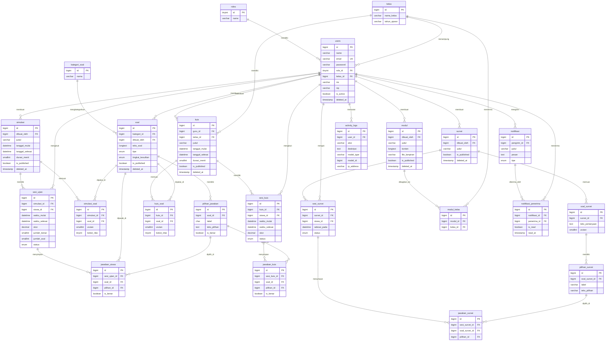

# 🗄️ Dokumen Perancangan Struktur Database

## Portal Latihan TKA — UPTD SDN Muncul 02

> **Versi Dokumen:** 1.0.0
> **Tanggal:** Juni 2026
> **Tech Stack:** Laravel 13 · PHP 8.3 · MySQL 8.4 · React 19 (PWA)
> **Penulis:** Muhammad Kaisa Nabhan

---

## Daftar Isi

1. [Analisis Kebutuhan Data](#1-analisis-kebutuhan-data)
2. [Daftar Entitas Utama](#2-daftar-entitas-utama)
3. [Penjelasan Fungsi Setiap Entitas](#3-penjelasan-fungsi-setiap-entitas)
4. [Atribut Tabel &amp; Tipe Data](#4-atribut-tabel--tipe-data)
5. [Primary Key, Foreign Key, Unique Key &amp; Index](#5-primary-key-foreign-key-unique-key--index)
6. [Relasi Antar Tabel](#6-relasi-antar-tabel)
7. [Alasan Pembentukan Relasi](#7-alasan-pembentukan-relasi)
8. [Visualisasi ERD (Mermaid)](#8-visualisasi-erd-mermaid)
9. [Struktur DBML untuk dbdiagram.io](#9-struktur-dbml-untuk-dbdiagramio)
10. [Evaluasi Normalisasi (1NF → 3NF)](#10-evaluasi-normalisasi-1nf--3nf)
11. [Tabel Audit, Log &amp; Notifikasi](#11-tabel-audit-log--notifikasi)
12. [Rekomendasi Optimasi untuk Laravel](#12-rekomendasi-optimasi-untuk-laravel)

---

## 1. Analisis Kebutuhan Data

Berdasarkan dokumentasi README, sistem **Portal Latihan TKA** memiliki fitur-fitur berikut yang masing-masing menghasilkan kebutuhan data yang harus disimpan:

| No | Fitur / Modul                 | Kebutuhan Data                                                                 |
| -- | ----------------------------- | ------------------------------------------------------------------------------ |
| 1  | **Autentikasi & RBAC**  | Data pengguna, peran, token autentikasi (Sanctum)                              |
| 2  | **Manajemen Pengguna**  | Data admin, guru, siswa beserta informasi kelas                                |
| 3  | **Bank Soal**           | Soal akademik & survei, pilihan jawaban, kunci jawaban, format rich-text/LaTeX |
| 4  | **Simulasi TKA**        | Jadwal simulasi, durasi, soal yang digunakan, status publikasi                 |
| 5  | **Kuis Mandiri (Guru)** | Kuis per kelas, soal yang dipilih guru, jadwal, status                         |
| 6  | **Pengerjaan Ujian**    | Sesi ujian siswa, jawaban per soal, waktu mulai/selesai, skor                  |
| 7  | **Survei Non-Kognitif** | Pertanyaan survei, jawaban siswa, hasil survei                                 |
| 8  | **Modul Pembelajaran**  | Konten materi, lampiran file, asosiasi kelas/siswa                             |
| 9  | **Laporan & Statistik** | Agregasi skor, histori pengerjaan, data ekspor                                 |
| 10 | **Notifikasi**          | Pengumuman, broadcast kelas, notifikasi individual                             |
| 11 | **Log Aktivitas**       | Rekam jejak seluruh aktivitas aktor di sistem                                  |
| 12 | **Agenda / Jadwal**     | Kalender agenda guru (jadwal simulasi & kuis)                                  |

---

## 2. Daftar Entitas Utama

```
KELOMPOK PENGGUNA
├── users
├── roles
└── kelas

KELOMPOK SOAL
├── soal
├── pilihan_jawaban
└── kategori_soal

KELOMPOK UJIAN
├── simulasi
├── simulasi_soal        (pivot)
├── sesi_ujian
└── jawaban_siswa

KELOMPOK KUIS
├── kuis
├── kuis_soal            (pivot)
├── sesi_kuis
└── jawaban_kuis

KELOMPOK SURVEI
├── survei
├── soal_survei
├── pilihan_survei
├── sesi_survei
└── jawaban_survei

KELOMPOK MODUL
├── modul
└── modul_kelas          (pivot)

KELOMPOK PENDUKUNG
├── notifikasi
├── notifikasi_penerima  (pivot)
├── activity_logs
└── personal_access_tokens (Sanctum — bawaan Laravel)
```

---

## 3. Penjelasan Fungsi Setiap Entitas

| Tabel                      | Fungsi Bisnis                                                                                                         |
| -------------------------- | --------------------------------------------------------------------------------------------------------------------- |
| `users`                  | Menyimpan seluruh akun pengguna sistem (admin, guru, siswa) dengan peran yang berbeda.                                |
| `roles`                  | Mendefinisikan peran RBAC:`admin`, `guru`, `siswa`. Digunakan sebagai referensi kontrol akses middleware.       |
| `kelas`                  | Menyimpan data kelas (misal: Kelas 6A, 6B). Guru dikaitkan sebagai wali kelas; siswa dikaitkan sebagai anggota kelas. |
| `kategori_soal`          | Mengelompokkan soal berdasarkan mata pelajaran atau topik (Matematika, Bahasa Indonesia, IPA, dll).                   |
| `soal`                   | Bank soal terpusat yang memuat pertanyaan dalam format rich-text/LaTeX, tipe soal, dan status publikasi.              |
| `pilihan_jawaban`        | Menyimpan opsi jawaban (A, B, C, D) untuk setiap soal pilihan ganda beserta penanda kunci jawaban.                    |
| `simulasi`               | Menyimpan data simulasi TKA tingkat sekolah yang dibuat admin: nama, jadwal, durasi, dan status.                      |
| `simulasi_soal`          | Tabel pivot yang menghubungkan simulasi dengan soal-soal yang dipilih dan urutan tampilannya.                         |
| `sesi_ujian`             | Merekam setiap percobaan siswa mengerjakan simulasi: waktu mulai, waktu selesai, dan skor akhir.                      |
| `jawaban_siswa`          | Menyimpan detail jawaban yang dipilih siswa per soal dalam sebuah sesi ujian.                                         |
| `kuis`                   | Kuis mandiri yang dibuat oleh guru untuk kelas yang diampu, termasuk jadwal dan batas waktu.                          |
| `kuis_soal`              | Tabel pivot yang menghubungkan kuis dengan soal-soal yang dipilih guru.                                               |
| `sesi_kuis`              | Merekam percobaan siswa mengerjakan kuis mandiri buatan guru.                                                         |
| `jawaban_kuis`           | Menyimpan detail jawaban siswa per soal dalam sebuah sesi kuis.                                                       |
| `survei`                 | Menyimpan survei non-kognitif (karakter & lingkungan belajar) yang dibuat admin.                                      |
| `soal_survei`            | Pertanyaan-pertanyaan dalam sebuah survei (bersifat non-penilaian).                                                   |
| `pilihan_survei`         | Opsi jawaban untuk setiap pertanyaan survei.                                                                          |
| `sesi_survei`            | Merekam setiap pengisian survei oleh siswa.                                                                           |
| `jawaban_survei`         | Menyimpan jawaban yang dipilih siswa untuk setiap pertanyaan survei.                                                  |
| `modul`                  | Konten materi pembelajaran yang diunggah admin atau guru, dapat berupa teks atau lampiran file.                       |
| `modul_kelas`            | Tabel pivot yang mengatur distribusi modul ke kelas-kelas tertentu.                                                   |
| `notifikasi`             | Menyimpan pesan/pengumuman yang dikirim guru atau admin ke siswa.                                                     |
| `notifikasi_penerima`    | Tabel pivot penerima notifikasi; menyimpan status sudah-baca per penerima.                                            |
| `activity_logs`          | Merekam semua aksi penting yang dilakukan pengguna (login, buat soal, submit ujian, dll).                             |
| `personal_access_tokens` | Tabel bawaan Laravel Sanctum untuk menyimpan token autentikasi API.                                                   |

---

## 4. Atribut Tabel & Tipe Data

### 4.1 Tabel `roles`

| Kolom          | Tipe Data            | Keterangan                                |
| -------------- | -------------------- | ----------------------------------------- |
| `id_role`    | `TINYINT UNSIGNED` | Primary Key, auto increment               |
| `name`       | `VARCHAR(20)`      | Nama peran:`admin`, `guru`, `siswa` |
| `created_at` | `TIMESTAMP`        | Laravel timestamps                        |
| `updated_at` | `TIMESTAMP`        | Laravel timestamps                        |

---

### 4.2 Tabel pengguna

| Kolom              | Tipe Data                | Keterangan                                             |
| ------------------ | ------------------------ | ------------------------------------------------------ |
| `id_pengguna`    | `BIGINT UNSIGNED`      | Primary Key, auto increment                            |
| `name`           | `VARCHAR(100)`         | Nama lengkap pengguna                                  |
| `email`          | `VARCHAR(150)`         | Alamat email, unik                                     |
| `password`       | `VARCHAR(255)`         | Hash bcrypt password                                   |
| `role_id`        | `TINYINT UNSIGNED`     | FK →`roles.id`                                      |
| `kelas_id`       | `BIGINT UNSIGNED NULL` | FK →`kelas.id`; diisi untuk siswa & guru wali kelas |
| `nis`            | `VARCHAR(20) NULL`     | Nomor Induk Siswa (khusus role siswa)                  |
| `nip`            | `VARCHAR(30) NULL`     | Nomor Induk Pegawai (khusus role guru)                 |
| `jenis_kelamin`  | `ENUM('L','P') NULL`   | Jenis kelamin                                          |
| `is_active`      | `BOOLEAN`              | Status aktif akun (default: true)                      |
| `remember_token` | `VARCHAR(100) NULL`    | Token remember me                                      |
| `created_at`     | `TIMESTAMP`            | —                                                     |
| `updated_at`     | `TIMESTAMP`            | —                                                     |
| `deleted_at`     | `TIMESTAMP NULL`       | Soft delete (Laravel)                                  |

---

### 4.3 Tabel `kelas`

| Kolom            | Tipe Data           | Keterangan         |
| ---------------- | ------------------- | ------------------ |
| `id_kelas`     | `BIGINT UNSIGNED` | Primary Key        |
| `nama_kelas`   | `VARCHAR(50)`     | Misal: "Kelas 6A"  |
| `tahun_ajaran` | `VARCHAR(9)`      | Misal: "2025/2026" |
| `created_at`   | `TIMESTAMP`       | —                 |
| `updated_at`   | `TIMESTAMP`       | —                 |

---

### 4.4 Tabel `kategori_soal`

| Kolom               | Tipe Data           | Keterangan                               |
| ------------------- | ------------------- | ---------------------------------------- |
| `id_kategorisoal` | `BIGINT UNSIGNED` | Primary Key                              |
| `nama`            | `VARCHAR(100)`    | Nama kategori (Matematika, B. Indonesia) |
| `deskripsi`       | `TEXT NULL`       | Deskripsi opsional                       |
| `created_at`      | `TIMESTAMP`       | —                                       |
| `updated_at`      | `TIMESTAMP`       | —                                       |

---

### 4.5 Tabel `soal`

| Kolom               | Tipe Data                                                                      | Keterangan                                   |
| ------------------- | ------------------------------------------------------------------------------ | -------------------------------------------- |
| `id_soal`         | `BIGINT UNSIGNED`                                                            | Primary Key                                  |
| `kategorisoal_id` | `BIGINT UNSIGNED`                                                            | FK →`kategori_soal.id`                    |
| `dibuat_oleh`     | `BIGINT UNSIGNED`                                                            | FK →`users.id` (admin yang membuat)       |
| `teks_soal`       | `LONGTEXT`                                                                   | Teks soal (mendukung HTML rich-text & LaTeX) |
| `tipe`            | `ENUM('pilihan_ganda','pilihan ganda kompleks','uraian','benar atau salah')` | Tipe soal                                    |
| `is_published`    | `BOOLEAN`                                                                    | Status publikasi ke bank soal                |
| `created_at`      | `TIMESTAMP`                                                                  | —                                           |
| `updated_at`      | `TIMESTAMP`                                                                  | —                                           |
| `deleted_at`      | `TIMESTAMP NULL`                                                             | Soft delete                                  |

---

### 4.6 Tabel `pilihan_jawaban`

| Kolom            | Tipe Data           | Keterangan                                               |
| ---------------- | ------------------- | -------------------------------------------------------- |
| `id_jawaban`   | `BIGINT UNSIGNED` | Primary Key                                              |
| `soal_id`      | `BIGINT UNSIGNED` | FK →`soal.id`                                         |
| `label`        | `CHAR(1)`         | Label opsi: A, B, C, D dan benar atau salah serta essay |
| `teks_pilihan` | `TEXT`            | Teks pilihan jawaban (mendukung rich-text)               |
| `is_benar`     | `BOOLEAN`         | Penanda kunci jawaban                                    |
| `created_at`   | `TIMESTAMP`       | —                                                       |
| `updated_at`   | `TIMESTAMP`       | —                                                       |

---

### 4.7 Tabel `simulasi`

| Kolom               | Tipe Data             | Keterangan                         |
| ------------------- | --------------------- | ---------------------------------- |
| `id_simulasitka`  | `BIGINT UNSIGNED`   | Primary Key                        |
| `dibuat_oleh`     | `BIGINT UNSIGNED`   | FK →`users.id` (admin)          |
| `judul`           | `VARCHAR(200)`      | Judul simulasi TKA                 |
| `deskripsi`       | `TEXT NULL`         | Deskripsi atau petunjuk pengerjaan |
| `tanggal_mulai`   | `DATETIME`          | Waktu ujian dibuka                 |
| `tanggal_selesai` | `DATETIME`          | Waktu ujian ditutup                |
| `durasi_menit`    | `SMALLINT UNSIGNED` | Durasi pengerjaan dalam menit      |
| `is_published`    | `BOOLEAN`           | Status publikasi                   |
| `created_at`      | `TIMESTAMP`         | —                                 |
| `updated_at`      | `TIMESTAMP`         | —                                 |
| `deleted_at`      | `TIMESTAMP NULL`    | Soft delete                        |

---

### 4.8 Tabel `simulasi_soal` *(pivot)*

| Kolom              | Tipe Data             | Keterangan                             |
| ------------------ | --------------------- | -------------------------------------- |
| `id`             | `BIGINT UNSIGNED`   | Primary Key                            |
| `simulasitka_id` | `BIGINT UNSIGNED`   | FK →`simulasi.id`                   |
| `soal_id`        | `BIGINT UNSIGNED`   | FK →`soal.id`                       |
| `urutan`         | `SMALLINT UNSIGNED` | Urutan tampil soal dalam simulasi      |
| `bobot_nilai`    | `TINYINT UNSIGNED`  | Bobot poin untuk soal ini (default: 1) |

---

### 4.9 Tabel `sesi_simulasitka`

| Kolom               | Tipe Data                                   | Keterangan                              |
| ------------------- | ------------------------------------------- | --------------------------------------- |
| `id_simulasi_tka` | `BIGINT UNSIGNED`                         | Primary Key                             |
| `simulasitka_id`  | `BIGINT UNSIGNED`                         | FK →`simulasi.id`                    |
| `siswa_id`        | `BIGINT UNSIGNED`                         | FK →`users.id`                       |
| `waktu_mulai`     | `DATETIME`                                | Waktu siswa memulai                     |
| `waktu_selesai`   | `DATETIME NULL`                           | Waktu siswa menyelesaikan / waktu habis |
| `skor`            | `DECIMAL(5,2) NULL`                       | Skor akhir (dihitung setelah submit)    |
| `jumlah_benar`    | `SMALLINT UNSIGNED NULL`                  | Total jawaban benar                     |
| `jumlah_soal`     | `SMALLINT UNSIGNED`                       | Total soal yang ditampilkan             |
| `status`          | `ENUM('berlangsung','selesai','timeout')` | Status sesi                             |
| `created_at`      | `TIMESTAMP`                               | —                                      |
| `updated_at`      | `TIMESTAMP`                               | —                                      |

---

### 4.10 Tabel `jawaban_siswa`

| Kolom                | Tipe Data                | Keterangan                                       |
| -------------------- | ------------------------ | ------------------------------------------------ |
| `id_jawabansiswa`  | `BIGINT UNSIGNED`      | Primary Key                                      |
| `sesi_simulasi_id` | `BIGINT UNSIGNED`      | FK →`sesi_ujian.id`                           |
| `soal_id`          | `BIGINT UNSIGNED`      | FK →`soal.id`                                 |
| `pilihan_id`       | `BIGINT UNSIGNED NULL` | FK →`pilihan_jawaban.id` (NULL jika dilewati) |
| `is_benar`         | `BOOLEAN NULL`         | Hasil koreksi otomatis                           |
| `created_at`       | `TIMESTAMP`            | —                                               |
| `updated_at`       | `TIMESTAMP`            | —                                               |

---

### 4.11 Tabel `kuis`

| Kolom               | Tipe Data                  | Keterangan                       |
| ------------------- | -------------------------- | -------------------------------- |
| `id_kuis`         | `BIGINT UNSIGNED`        | Primary Key                      |
| `guru_id`         | `BIGINT UNSIGNED`        | FK →`users.id` (guru pembuat) |
| `kelas_id`        | `BIGINT UNSIGNED`        | FK →`kelas.id`                |
| `judul`           | `VARCHAR(200)`           | Judul kuis                       |
| `deskripsi`       | `TEXT NULL`              | Petunjuk kuis                    |
| `tanggal_mulai`   | `DATETIME NULL`          | Waktu kuis dibuka                |
| `tanggal_selesai` | `DATETIME NULL`          | Waktu kuis ditutup               |
| `durasi_menit`    | `SMALLINT UNSIGNED NULL` | Durasi pengerjaan                |
| `is_published`    | `BOOLEAN`                | Status publikasi                 |
| `created_at`      | `TIMESTAMP`              | —                               |
| `updated_at`      | `TIMESTAMP`              | —                               |
| `deleted_at`      | `TIMESTAMP NULL`         | Soft delete                      |

---

### 4.12 Tabel `kuis_soal` *(pivot)*

| Kolom            | Tipe Data             | Keterangan              |
| ---------------- | --------------------- | ----------------------- |
| `id_soal_kuis` | `BIGINT UNSIGNED`   | Primary Key             |
| `kuis_id`      | `BIGINT UNSIGNED`   | FK →`kuis.id`        |
| `soal_id`      | `BIGINT UNSIGNED`   | FK →`soal.id`        |
| `urutan`       | `SMALLINT UNSIGNED` | Urutan tampil soal      |
| `bobot_nilai`  | `TINYINT UNSIGNED`  | Bobot poin (default: 1) |

---

### 4.13 Tabel `sesi_kuis`

| Kolom             | Tipe Data                                   | Keterangan        |
| ----------------- | ------------------------------------------- | ----------------- |
| `id_sesi_kuis`  | `BIGINT UNSIGNED`                         | Primary Key       |
| `kuis_id`       | `BIGINT UNSIGNED`                         | FK →`kuis.id`  |
| `siswa_id`      | `BIGINT UNSIGNED`                         | FK →`users.id` |
| `waktu_mulai`   | `DATETIME`                                | —                |
| `waktu_selesai` | `DATETIME NULL`                           | —                |
| `skor`          | `DECIMAL(5,2) NULL`                       | Skor akhir        |
| `jumlah_benar`  | `SMALLINT UNSIGNED NULL`                  | —                |
| `jumlah_soal`   | `SMALLINT UNSIGNED`                       | —                |
| `status`        | `ENUM('berlangsung','selesai','timeout')` | —                |
| `created_at`    | `TIMESTAMP`                               | —                |
| `updated_at`    | `TIMESTAMP`                               | —                |

---

### 4.14 Tabel `jawaban_kuis`

| Kolom               | Tipe Data                | Keterangan                  |
| ------------------- | ------------------------ | --------------------------- |
| `id_jawaban_kuis` | `BIGINT UNSIGNED`      | Primary Key                 |
| `sesi_kuis_id`    | `BIGINT UNSIGNED`      | FK →`sesi_kuis.id`       |
| `soal_id`         | `BIGINT UNSIGNED`      | FK →`soal.id`            |
| `pilihan_id`      | `BIGINT UNSIGNED NULL` | FK →`pilihan_jawaban.id` |
| `is_benar`        | `BOOLEAN NULL`         | Hasil koreksi otomatis      |
| `created_at`      | `TIMESTAMP`            | —                          |
| `updated_at`      | `TIMESTAMP`            | —                          |

---

### 4.15 Tabel `survei`

| Kolom            | Tipe Data           | Keterangan                |
| ---------------- | ------------------- | ------------------------- |
| `id_survei`    | `BIGINT UNSIGNED` | Primary Key               |
| `dibuat_oleh`  | `BIGINT UNSIGNED` | FK →`users.id` (admin) |
| `judul`        | `VARCHAR(200)`    | Judul survei              |
| `deskripsi`    | `TEXT NULL`       | Deskripsi survei          |
| `is_published` | `BOOLEAN`         | Status publikasi          |
| `created_at`   | `TIMESTAMP`       | —                        |
| `updated_at`   | `TIMESTAMP`       | —                        |
| `deleted_at`   | `TIMESTAMP NULL`  | Soft delete               |

---

### 4.16 Tabel `soal_survei`

| Kolom               | Tipe Data             | Keterangan             |
| ------------------- | --------------------- | ---------------------- |
| `id_soal_survei`  | `BIGINT UNSIGNED`   | Primary Key            |
| `survei_id`       | `BIGINT UNSIGNED`   | FK →`survei.id`     |
| `teks_pertanyaan` | `TEXT`              | Teks pertanyaan survei |
| `urutan`          | `SMALLINT UNSIGNED` | Urutan pertanyaan      |
| `created_at`      | `TIMESTAMP`         | —                     |
| `updated_at`      | `TIMESTAMP`         | —                     |

---

### 4.17 Tabel `pilihan_survei`

| Kolom                 | Tipe Data           | Keterangan              |
| --------------------- | ------------------- | ----------------------- |
| `id_pilihan_survei` | `BIGINT UNSIGNED` | Primary Key             |
| `soal_survei_id`    | `BIGINT UNSIGNED` | FK →`soal_survei.id` |
| `label`             | `VARCHAR(10)`     | Label opsi              |
| `teks_pilihan`      | `VARCHAR(255)`    | Teks opsi jawaban       |

---

### 4.18 Tabel `sesi_survei`

| Kolom              | Tipe Data                         | Keterangan                |
| ------------------ | --------------------------------- | ------------------------- |
| `id_sesi_survei` | `BIGINT UNSIGNED`               | Primary Key               |
| `survei_id`      | `BIGINT UNSIGNED`               | FK →`survei.id`        |
| `siswa_id`       | `BIGINT UNSIGNED`               | FK →`users.id`         |
| `selesai_pada`   | `DATETIME NULL`                 | Waktu survei diselesaikan |
| `status`         | `ENUM('berlangsung','selesai')` | Status pengisian          |
| `created_at`     | `TIMESTAMP`                     | —                        |
| `updated_at`     | `TIMESTAMP`                     | —                        |

---

### 4.19 Tabel `jawaban_survei`

| Kolom                 | Tipe Data                | Keterangan                 |
| --------------------- | ------------------------ | -------------------------- |
| `id_jawaban_survei` | `BIGINT UNSIGNED`      | Primary Key                |
| `sesi_survei_id`    | `BIGINT UNSIGNED`      | FK →`sesi_survei.id`    |
| `soal_survei_id`    | `BIGINT UNSIGNED`      | FK →`soal_survei.id`    |
| `pilihan_id`        | `BIGINT UNSIGNED NULL` | FK →`pilihan_survei.id` |
| `created_at`        | `TIMESTAMP`            | —                         |

---

### 4.20 Tabel `modul`

| Kolom             | Tipe Data             | Keterangan                           |
| ----------------- | --------------------- | ------------------------------------ |
| `id_modul`      | `BIGINT UNSIGNED`   | Primary Key                          |
| `dibuat_oleh`   | `BIGINT UNSIGNED`   | FK →`users.id` (guru/admin)       |
| `judul`         | `VARCHAR(200)`      | Judul modul                          |
| `konten`        | `LONGTEXT NULL`     | Konten teks modul (rich-text)        |
| `file_lampiran` | `VARCHAR(255) NULL` | Path file lampiran (PDF, video, dll) |
| `tipe_file`     | `VARCHAR(50) NULL`  | MIME type lampiran                   |
| `is_published`  | `BOOLEAN`           | Status publikasi                     |
| `created_at`    | `TIMESTAMP`         | —                                   |
| `updated_at`    | `TIMESTAMP`         | —                                   |
| `deleted_at`    | `TIMESTAMP NULL`    | Soft delete                          |

---

### 4.21 Tabel `modul_kelas` *(pivot)*

| Kolom              | Tipe Data           | Keterangan        |
| ------------------ | ------------------- | ----------------- |
| `id_modul_kelas` | `BIGINT UNSIGNED` | Primary Key       |
| `modul_id`       | `BIGINT UNSIGNED` | FK →`modul.id` |
| `kelas_id`       | `BIGINT UNSIGNED` | FK →`kelas.id` |
| `created_at`     | `TIMESTAMP`       | —                |

---

### 4.22 Tabel `notifikasi`

| Kolom             | Tipe Data                                | Keterangan                     |
| ----------------- | ---------------------------------------- | ------------------------------ |
| `id_notifikasi` | `BIGINT UNSIGNED`                      | Primary Key                    |
| `pengirim_id`   | `BIGINT UNSIGNED`                      | FK →`users.id` (guru/admin) |
| `judul`         | `VARCHAR(200)`                         | Judul notifikasi               |
| `pesan`         | `TEXT`                                 | Isi notifikasi                 |
| `tipe`          | `ENUM('pengumuman','jadwal','sistem')` | Jenis notifikasi               |
| `created_at`    | `TIMESTAMP`                            | —                             |

---

### 4.23 Tabel `notifikasi_penerima` *(pivot)*

| Kolom                      | Tipe Data           | Keterangan             |
| -------------------------- | ------------------- | ---------------------- |
| `id_notifikasi_penerima` | `BIGINT UNSIGNED` | Primary Key            |
| `notifikasi_id`          | `BIGINT UNSIGNED` | FK →`notifikasi.id` |
| `penerima_id`            | `BIGINT UNSIGNED` | FK →`users.id`      |
| `is_read`                | `BOOLEAN`         | Status sudah dibaca    |
| `read_at`                | `TIMESTAMP NULL`  | Waktu dibaca           |
| `created_at`             | `TIMESTAMP`       | —                     |

---

### 4.24 Tabel `activity_logs`

| Kolom          | Tipe Data                | Keterangan                                                   |
| -------------- | ------------------------ | ------------------------------------------------------------ |
| `id`         | `BIGINT UNSIGNED`      | Primary Key                                                  |
| `user_id`    | `BIGINT UNSIGNED NULL` | FK →`users.id` (NULL jika sistem)                         |
| `aksi`       | `VARCHAR(100)`         | Nama aksi (misal:`login`, `buat_soal`, `submit_ujian`) |
| `deskripsi`  | `TEXT NULL`            | Deskripsi detail aksi                                        |
| `model_type` | `VARCHAR(100) NULL`    | Kelas model yang terpengaruh (polymorphic)                   |
| `model_id`   | `BIGINT UNSIGNED NULL` | ID record yang terpengaruh                                   |
| `ip_address` | `VARCHAR(45) NULL`     | IP address pengguna                                          |
| `user_agent` | `VARCHAR(255) NULL`    | Browser/device info                                          |
| `created_at` | `TIMESTAMP`            | Waktu kejadian                                               |

---

## 5. Primary Key, Foreign Key, Unique Key & Index

### Primary Keys

Seluruh tabel menggunakan `BIGINT UNSIGNED AUTO_INCREMENT` sebagai PK, kecuali `roles` yang menggunakan `TINYINT UNSIGNED`.

### Foreign Keys & Constraints

| Tabel                   | Kolom FK           | Referensi              | ON DELETE | ON UPDATE |
| ----------------------- | ------------------ | ---------------------- | --------- | --------- |
| `pengguna`            | `role_id`        | `roles.id`           | RESTRICT  | CASCADE   |
| `pengguna`            | `kelas_id`       | `kelas.id`           | SET NULL  | CASCADE   |
| `soal`                | `kategori_id`    | `kategori_soal.id`   | RESTRICT  | CASCADE   |
| `soal`                | `dibuat_oleh`    | `users.id`           | RESTRICT  | CASCADE   |
| `pilihan_jawaban`     | `soal_id`        | `soal.id`            | CASCADE   | CASCADE   |
| `simulasi`            | `dibuat_oleh`    | `users.id`           | RESTRICT  | CASCADE   |
| `simulasi_soal`       | `simulasi_id`    | `simulasi.id`        | CASCADE   | CASCADE   |
| `simulasi_soal`       | `soal_id`        | `soal.id`            | CASCADE   | CASCADE   |
| `sesi_ujian`          | `simulasi_id`    | `simulasi.id`        | RESTRICT  | CASCADE   |
| `sesi_ujian`          | `siswa_id`       | `users.id`           | RESTRICT  | CASCADE   |
| `jawaban_siswa`       | `sesi_ujian_id`  | `sesi_ujian.id`      | CASCADE   | CASCADE   |
| `jawaban_siswa`       | `soal_id`        | `soal.id`            | RESTRICT  | CASCADE   |
| `jawaban_siswa`       | `pilihan_id`     | `pilihan_jawaban.id` | SET NULL  | CASCADE   |
| `kuis`                | `guru_id`        | `users.id`           | RESTRICT  | CASCADE   |
| `kuis`                | `kelas_id`       | `kelas.id`           | RESTRICT  | CASCADE   |
| `kuis_soal`           | `kuis_id`        | `kuis.id`            | CASCADE   | CASCADE   |
| `kuis_soal`           | `soal_id`        | `soal.id`            | CASCADE   | CASCADE   |
| `sesi_kuis`           | `kuis_id`        | `kuis.id`            | RESTRICT  | CASCADE   |
| `sesi_kuis`           | `siswa_id`       | `users.id`           | RESTRICT  | CASCADE   |
| `jawaban_kuis`        | `sesi_kuis_id`   | `sesi_kuis.id`       | CASCADE   | CASCADE   |
| `jawaban_kuis`        | `pilihan_id`     | `pilihan_jawaban.id` | SET NULL  | CASCADE   |
| `survei`              | `dibuat_oleh`    | `users.id`           | RESTRICT  | CASCADE   |
| `soal_survei`         | `survei_id`      | `survei.id`          | CASCADE   | CASCADE   |
| `pilihan_survei`      | `soal_survei_id` | `soal_survei.id`     | CASCADE   | CASCADE   |
| `sesi_survei`         | `survei_id`      | `survei.id`          | RESTRICT  | CASCADE   |
| `sesi_survei`         | `siswa_id`       | `users.id`           | RESTRICT  | CASCADE   |
| `jawaban_survei`      | `sesi_survei_id` | `sesi_survei.id`     | CASCADE   | CASCADE   |
| `jawaban_survei`      | `pilihan_id`     | `pilihan_survei.id`  | SET NULL  | CASCADE   |
| `modul`               | `dibuat_oleh`    | `users.id`           | RESTRICT  | CASCADE   |
| `modul_kelas`         | `modul_id`       | `modul.id`           | CASCADE   | CASCADE   |
| `modul_kelas`         | `kelas_id`       | `kelas.id`           | CASCADE   | CASCADE   |
| `notifikasi`          | `pengirim_id`    | `users.id`           | RESTRICT  | CASCADE   |
| `notifikasi_penerima` | `notifikasi_id`  | `notifikasi.id`      | CASCADE   | CASCADE   |
| `notifikasi_penerima` | `penerima_id`    | `users.id`           | CASCADE   | CASCADE   |
| `activity_logs`       | `user_id`        | `users.id`           | SET NULL  | CASCADE   |

### Unique Keys

| Tabel                   | Kolom                            | Alasan                                        |
| ----------------------- | -------------------------------- | --------------------------------------------- |
| `pengguna`            | `nis`                          | Nomor induk siswa tidak boleh duplikat        |
| `pengguna`            | `nip`                          | Nomor induk pegawai tidak boleh duplikat      |
| `roles`               | `name`                         | Nama peran unik                               |
| `kelas`               | `(nama_kelas, tahun_ajaran)`   | Kombinasi kelas+tahun unik                    |
| `simulasi_soal`       | `(simulasi_id, soal_id)`       | Satu soal hanya muncul sekali per simulasi    |
| `kuis_soal`           | `(kuis_id, soal_id)`           | Satu soal hanya muncul sekali per kuis        |
| `sesi_ujian`          | `(simulasi_id, siswa_id)`      | Satu siswa hanya punya satu sesi per simulasi |
| `sesi_kuis`           | `(kuis_id, siswa_id)`          | Satu siswa hanya punya satu sesi per kuis     |
| `sesi_survei`         | `(survei_id, siswa_id)`        | Satu siswa hanya isi survei sekali            |
| `modul_kelas`         | `(modul_id, kelas_id)`         | Distribusi tidak duplikat                     |
| `notifikasi_penerima` | `(notifikasi_id, penerima_id)` | Tidak ada duplikat penerima                   |

### Index Performa Tambahan

| Tabel                   | Index Kolom                         | Tujuan                      |
| ----------------------- | ----------------------------------- | --------------------------- |
| `pengguna`            | `role_id`                         | Filter pengguna per peran   |
| `pengguna`            | `kelas_id`                        | Daftar siswa per kelas      |
| `soal`                | `kategori_id`, `is_published`   | Filter bank soal            |
| `simulasi`            | `tanggal_mulai`, `is_published` | Filter jadwal aktif         |
| `sesi_ujian`          | `siswa_id`, `status`            | Riwayat pengerjaan siswa    |
| `sesi_ujian`          | `simulasi_id`                     | Monitoring per simulasi     |
| `jawaban_siswa`       | `sesi_ujian_id`                   | Koreksi otomatis            |
| `kuis`                | `guru_id`, `kelas_id`           | Daftar kuis per guru/kelas  |
| `activity_logs`       | `user_id`, `created_at`         | Filter log per user & waktu |
| `notifikasi_penerima` | `penerima_id`, `is_read`        | Notifikasi belum dibaca     |

---

## 6. Relasi Antar Tabel

### One-to-Many (1:N)

| Tabel Induk       | Tabel Anak          | Keterangan                                          |
| ----------------- | ------------------- | --------------------------------------------------- |
| `roles`         | `users`           | Satu role dimiliki banyak pengguna                  |
| `kelas`         | `users`           | Satu kelas memiliki banyak siswa                    |
| `kategori_soal` | `soal`            | Satu kategori memuat banyak soal                    |
| `users` (admin) | `soal`            | Satu admin membuat banyak soal                      |
| `soal`          | `pilihan_jawaban` | Satu soal memiliki pilhan jawaban sesuai jenis soal |
| `users` (admin) | `simulasi`        | Satu admin membuat banyak simulasi                  |
| `simulasi`      | `sesi_ujian`      | Satu simulasi diikuti banyak sesi siswa             |
| `users` (siswa) | `sesi_ujian`      | Satu siswa memiliki banyak riwayat sesi ujian       |
| `sesi_ujian`    | `jawaban_siswa`   | Satu sesi ujian memiliki banyak jawaban soal        |
| `users` (guru)  | `kuis`            | Satu guru membuat banyak kuis                       |
| `kelas`         | `kuis`            | Satu kelas memiliki banyak kuis                     |
| `kuis`          | `sesi_kuis`       | Satu kuis diikuti banyak sesi siswa                 |
| `sesi_kuis`     | `jawaban_kuis`    | Satu sesi kuis memiliki banyak jawaban              |
| `users` (admin) | `survei`          | Satu admin membuat banyak survei                    |
| `survei`        | `soal_survei`     | Satu survei memuat banyak pertanyaan                |
| `soal_survei`   | `pilihan_survei`  | Satu pertanyaan memiliki banyak pilihan             |
| `survei`        | `sesi_survei`     | Satu survei diisi banyak sesi siswa                 |
| `sesi_survei`   | `jawaban_survei`  | Satu sesi survei memiliki banyak jawaban            |
| `users`         | `modul`           | Satu guru/admin membuat banyak modul                |
| `users`         | `notifikasi`      | Satu pengirim membuat banyak notifikasi             |
| `users`         | `activity_logs`   | Satu pengguna memiliki banyak log aktivitas         |

### Many-to-Many (M:N) via Tabel Pivot

| Relasi                      | Tabel Pivot             | Keterangan                                                                       |
| --------------------------- | ----------------------- | -------------------------------------------------------------------------------- |
| `simulasi` ↔ `soal`    | `simulasi_soal`       | Satu simulasi berisi banyak soal; satu soal bisa dipakai di banyak simulasi      |
| `kuis` ↔ `soal`        | `kuis_soal`           | Satu kuis berisi banyak soal; satu soal bisa dipakai di banyak kuis              |
| `modul` ↔ `kelas`      | `modul_kelas`         | Satu modul bisa dibagikan ke banyak kelas; satu kelas bisa menerima banyak modul |
| `notifikasi` ↔ `users` | `notifikasi_penerima` | Satu notifikasi dikirim ke banyak siswa; satu siswa menerima banyak notifikasi   |

### One-to-One (1:1) Implisit

| Relasi                                  | Keterangan                                                                                           |
| --------------------------------------- | ---------------------------------------------------------------------------------------------------- |
| `sesi_ujian` ↔ `(simulasi, siswa)` | Melalui unique constraint `(simulasi_id, siswa_id)`, satu siswa hanya punya satu sesi per simulasi |
| `sesi_survei` ↔ `(survei, siswa)`  | Satu siswa hanya bisa mengisi survei yang sama sekali                                                |

---

## 7. Alasan Pembentukan Relasi

| Relasi                                      | Alasan Bisnis                                                                                                                                                                                                       |
| ------------------------------------------- | ------------------------------------------------------------------------------------------------------------------------------------------------------------------------------------------------------------------- |
| `users → roles`                          | Sistem menerapkan RBAC dengan 3 peran (admin, guru, siswa). Memisahkan roles ke tabel sendiri memungkinkan penambahan peran baru tanpa mengubah struktur `users`.                                                 |
| `users → kelas`                          | Siswa harus ditempatkan dalam kelas tertentu; guru berperan sebagai wali kelas. Relasi ini dibutuhkan untuk filter data per kelas (laporan, kuis, modul).                                                           |
| `soal → pilihan_jawaban`                 | Setiap soal pilihan ganda memiliki 4 opsi jawaban. Dipisahkan agar teks soal dan opsi dapat disimpan dalam format rich-text secara independen.                                                                      |
| `simulasi ↔ soal` (M:N)                  | Satu simulasi membutuhkan banyak soal dari bank soal. Sebaliknya, soal yang sama (misal dari bank soal) bisa digunakan di simulasi berbeda tanpa duplikasi data soal.                                               |
| `kuis ↔ soal` (M:N)                      | Alasan identik dengan simulasi–soal. Guru memilih soal dari bank soal terpusat.                                                                                                                                    |
| `simulasi → sesi_ujian → jawaban_siswa` | Rantai relasi ini memodelkan alur: simulasi dibuat → siswa membuka sesi → siswa menjawab soal. Setiap lapisan menyimpan data yang berbeda (skor, status, detail jawaban).                                         |
| `modul ↔ kelas` (M:N)                    | Guru dapat mendistribusikan satu modul ke beberapa kelas sekaligus (admin juga bisa). Ini lebih fleksibel daripada menyimpan `kelas_id` langsung di modul.                                                        |
| `notifikasi ↔ users` (M:N)               | Memungkinkan broadcast ke seluruh kelas (banyak penerima) sekaligus menyimpan status `is_read` per penerima secara individual.                                                                                    |
| `survei` terpisah dari `simulasi`       | Survei non-kognitif tidak memiliki kunci jawaban atau skor, berbeda secara fundamental dengan ujian akademik. Memisahkan entitas ini menjaga kejelasan model bisnis dan menghindari kolom nullable yang berlebihan. |

---

## 8. Visualisasi ERD (Mermaid)



---

## 9. Struktur DBML untuk dbdiagram.io

Salin dan tempel seluruh blok kode berikut ke [https://dbdiagram.io](https://dbdiagram.io):

```dbml
// ============================================================
//  Portal Latihan TKA — Database Schema (DBML)
//  Untuk diimpor ke https://dbdiagram.io
// ============================================================

Table roles {
  id tinyint [pk, increment, note: "PK"]
  name varchar(20) [unique, not null, note: "admin | guru | siswa"]
  created_at timestamp
  updated_at timestamp
}

Table kelas {
  id bigint [pk, increment]
  nama_kelas varchar(50) [not null]
  tahun_ajaran varchar(9) [not null, note: "Contoh: 2025/2026"]
  created_at timestamp
  updated_at timestamp

  indexes {
    (nama_kelas, tahun_ajaran) [unique]
  }
}

Table users {
  id bigint [pk, increment]
  name varchar(100) [not null]
  email varchar(150) [unique, not null]
  password varchar(255) [not null]
  role_id tinyint [not null, ref: > roles.id]
  kelas_id bigint [null, ref: > kelas.id]
  nis varchar(20) [null, unique, note: "Nomor Induk Siswa"]
  nip varchar(30) [null, unique, note: "Nomor Induk Pegawai"]
  jenis_kelamin char(1) [null, note: "L / P"]
  is_active boolean [not null, default: true]
  email_verified_at timestamp [null]
  remember_token varchar(100) [null]
  created_at timestamp
  updated_at timestamp
  deleted_at timestamp [null]

  indexes {
    role_id
    kelas_id
  }
}

Table kategori_soal {
  id bigint [pk, increment]
  nama varchar(100) [not null]
  deskripsi text [null]
  created_at timestamp
  updated_at timestamp
}

Table soal {
  id bigint [pk, increment]
  kategori_id bigint [not null, ref: > kategori_soal.id]
  dibuat_oleh bigint [not null, ref: > users.id]
  teks_soal longtext [not null, note: "Mendukung HTML rich-text & LaTeX"]
  tipe varchar(20) [not null, note: "pilihan_ganda | uraian"]
  tingkat_kesulitan varchar(10) [not null, note: "mudah | sedang | sulit"]
  is_published boolean [not null, default: false]
  created_at timestamp
  updated_at timestamp
  deleted_at timestamp [null]

  indexes {
    kategori_id
    (is_published)
  }
}

Table pilihan_jawaban {
  id bigint [pk, increment]
  soal_id bigint [not null, ref: > soal.id]
  label char(1) [not null, note: "A | B | C | D"]
  teks_pilihan text [not null]
  is_benar boolean [not null, default: false]
  created_at timestamp
  updated_at timestamp

  indexes {
    soal_id
  }
}

Table simulasi {
  id bigint [pk, increment]
  dibuat_oleh bigint [not null, ref: > users.id]
  judul varchar(200) [not null]
  deskripsi text [null]
  tanggal_mulai datetime [not null]
  tanggal_selesai datetime [not null]
  durasi_menit smallint [not null]
  is_published boolean [not null, default: false]
  created_at timestamp
  updated_at timestamp
  deleted_at timestamp [null]

  indexes {
    (tanggal_mulai, is_published)
  }
}

Table simulasi_soal {
  id bigint [pk, increment]
  simulasi_id bigint [not null, ref: > simulasi.id]
  soal_id bigint [not null, ref: > soal.id]
  urutan smallint [not null]
  bobot_nilai tinyint [not null, default: 1]

  indexes {
    (simulasi_id, soal_id) [unique]
  }
}

Table sesi_ujian {
  id bigint [pk, increment]
  simulasi_id bigint [not null, ref: > simulasi.id]
  siswa_id bigint [not null, ref: > users.id]
  waktu_mulai datetime [not null]
  waktu_selesai datetime [null]
  skor decimal(5,2) [null]
  jumlah_benar smallint [null]
  jumlah_soal smallint [not null]
  status varchar(15) [not null, note: "berlangsung | selesai | timeout"]
  created_at timestamp
  updated_at timestamp

  indexes {
    (simulasi_id, siswa_id) [unique]
    (siswa_id, status)
  }
}

Table jawaban_siswa {
  id bigint [pk, increment]
  sesi_ujian_id bigint [not null, ref: > sesi_ujian.id]
  soal_id bigint [not null, ref: > soal.id]
  pilihan_id bigint [null, ref: > pilihan_jawaban.id]
  is_benar boolean [null]
  created_at timestamp
  updated_at timestamp

  indexes {
    sesi_ujian_id
  }
}

Table kuis {
  id bigint [pk, increment]
  guru_id bigint [not null, ref: > users.id]
  kelas_id bigint [not null, ref: > kelas.id]
  judul varchar(200) [not null]
  deskripsi text [null]
  tanggal_mulai datetime [null]
  tanggal_selesai datetime [null]
  durasi_menit smallint [null]
  is_published boolean [not null, default: false]
  created_at timestamp
  updated_at timestamp
  deleted_at timestamp [null]

  indexes {
    (guru_id, kelas_id)
  }
}

Table kuis_soal {
  id bigint [pk, increment]
  kuis_id bigint [not null, ref: > kuis.id]
  soal_id bigint [not null, ref: > soal.id]
  urutan smallint [not null]
  bobot_nilai tinyint [not null, default: 1]

  indexes {
    (kuis_id, soal_id) [unique]
  }
}

Table sesi_kuis {
  id bigint [pk, increment]
  kuis_id bigint [not null, ref: > kuis.id]
  siswa_id bigint [not null, ref: > users.id]
  waktu_mulai datetime [not null]
  waktu_selesai datetime [null]
  skor decimal(5,2) [null]
  jumlah_benar smallint [null]
  jumlah_soal smallint [not null]
  status varchar(15) [not null, note: "berlangsung | selesai | timeout"]
  created_at timestamp
  updated_at timestamp

  indexes {
    (kuis_id, siswa_id) [unique]
  }
}

Table jawaban_kuis {
  id bigint [pk, increment]
  sesi_kuis_id bigint [not null, ref: > sesi_kuis.id]
  soal_id bigint [not null, ref: > soal.id]
  pilihan_id bigint [null, ref: > pilihan_jawaban.id]
  is_benar boolean [null]
  created_at timestamp
  updated_at timestamp

  indexes {
    sesi_kuis_id
  }
}

Table survei {
  id bigint [pk, increment]
  dibuat_oleh bigint [not null, ref: > users.id]
  judul varchar(200) [not null]
  deskripsi text [null]
  is_published boolean [not null, default: false]
  created_at timestamp
  updated_at timestamp
  deleted_at timestamp [null]
}

Table soal_survei {
  id bigint [pk, increment]
  survei_id bigint [not null, ref: > survei.id]
  teks_pertanyaan text [not null]
  urutan smallint [not null]
  created_at timestamp
  updated_at timestamp
}

Table pilihan_survei {
  id bigint [pk, increment]
  soal_survei_id bigint [not null, ref: > soal_survei.id]
  label varchar(10) [not null]
  teks_pilihan varchar(255) [not null]
}

Table sesi_survei {
  id bigint [pk, increment]
  survei_id bigint [not null, ref: > survei.id]
  siswa_id bigint [not null, ref: > users.id]
  selesai_pada datetime [null]
  status varchar(15) [not null, note: "berlangsung | selesai"]
  created_at timestamp
  updated_at timestamp

  indexes {
    (survei_id, siswa_id) [unique]
  }
}

Table jawaban_survei {
  id bigint [pk, increment]
  sesi_survei_id bigint [not null, ref: > sesi_survei.id]
  soal_survei_id bigint [not null, ref: > soal_survei.id]
  pilihan_id bigint [null, ref: > pilihan_survei.id]
  created_at timestamp
}

Table modul {
  id bigint [pk, increment]
  dibuat_oleh bigint [not null, ref: > users.id]
  judul varchar(200) [not null]
  konten longtext [null]
  file_lampiran varchar(255) [null]
  tipe_file varchar(50) [null]
  is_published boolean [not null, default: false]
  created_at timestamp
  updated_at timestamp
  deleted_at timestamp [null]
}

Table modul_kelas {
  id bigint [pk, increment]
  modul_id bigint [not null, ref: > modul.id]
  kelas_id bigint [not null, ref: > kelas.id]
  created_at timestamp

  indexes {
    (modul_id, kelas_id) [unique]
  }
}

Table notifikasi {
  id bigint [pk, increment]
  pengirim_id bigint [not null, ref: > users.id]
  judul varchar(200) [not null]
  pesan text [not null]
  tipe varchar(20) [not null, note: "pengumuman | jadwal | sistem"]
  created_at timestamp
}

Table notifikasi_penerima {
  id bigint [pk, increment]
  notifikasi_id bigint [not null, ref: > notifikasi.id]
  penerima_id bigint [not null, ref: > users.id]
  is_read boolean [not null, default: false]
  read_at timestamp [null]
  created_at timestamp

  indexes {
    (notifikasi_id, penerima_id) [unique]
    (penerima_id, is_read)
  }
}

Table activity_logs {
  id bigint [pk, increment]
  user_id bigint [null, ref: > users.id]
  aksi varchar(100) [not null]
  deskripsi text [null]
  model_type varchar(100) [null, note: "Polymorphic: nama kelas model"]
  model_id bigint [null]
  ip_address varchar(45) [null]
  user_agent varchar(255) [null]
  created_at timestamp

  indexes {
    (user_id, created_at)
    (model_type, model_id)
  }
}
```

---

## 10. Evaluasi Normalisasi (1NF → 3NF)

### 10.1 First Normal Form (1NF)

**Syarat:** Setiap kolom berisi nilai atomik; tidak ada grup yang berulang.

✅ **Terpenuhi.** Seluruh tabel dirancang tanpa kolom multi-nilai atau kolom yang menyimpan array. Contoh penerapan:

- Pilihan jawaban A/B/C/D **tidak** disimpan sebagai `JSON` dalam tabel `soal`, melainkan dipisahkan ke tabel `pilihan_jawaban` dengan satu baris per opsi.
- Daftar soal dalam simulasi **tidak** disimpan sebagai array di kolom `soal_ids`, melainkan menggunakan tabel pivot `simulasi_soal`.
- Penerima notifikasi **tidak** disimpan sebagai kolom teks dalam `notifikasi`, melainkan di `notifikasi_penerima`.

---

### 10.2 Second Normal Form (2NF)

**Syarat:** Sudah 1NF, dan setiap atribut non-kunci bergantung penuh pada seluruh PK (berlaku untuk tabel dengan composite key).

✅ **Terpenuhi.** Tabel pivot dirancang hanya menyimpan atribut yang merupakan properti dari relasi itu sendiri (bukan dari salah satu entitas):

- `simulasi_soal`: kolom `urutan` dan `bobot_nilai` adalah properti dari *hubungan* antara simulasi dan soal, bukan properti soal atau simulasi secara sendiri.
- `modul_kelas`: hanya menyimpan relasi distribusi, tidak ada atribut tambahan yang hanya bergantung pada `modul_id` atau `kelas_id` saja.
- `notifikasi_penerima`: kolom `is_read` dan `read_at` adalah properti dari *hubungan* notifikasi dengan penerima spesifik.

---

### 10.3 Third Normal Form (3NF)

**Syarat:** Sudah 2NF, dan tidak ada ketergantungan transitif (atribut non-kunci bergantung pada atribut non-kunci lain).

✅ **Terpenuhi.** Beberapa keputusan desain yang memastikan 3NF:

| Potensi Pelanggaran                                     | Solusi yang Diterapkan                                                                                                                                                                                                    |
| ------------------------------------------------------- | ------------------------------------------------------------------------------------------------------------------------------------------------------------------------------------------------------------------------- |
| Menyimpan `nama_kelas` di tabel `users`             | Dihindari.`users` hanya menyimpan `kelas_id` sebagai FK, nama kelas diambil via JOIN ke tabel `kelas`.                                                                                                              |
| Menyimpan `nama_kategori` di tabel `soal`           | Dihindari.`soal` hanya menyimpan `kategori_id`, nama kategori diambil dari `kategori_soal`.                                                                                                                         |
| Menyimpan `nama_guru` di tabel `kuis`               | Dihindari.`kuis` hanya menyimpan `guru_id`, nama guru diambil dari `users`.                                                                                                                                         |
| Menyimpan `skor_rata_rata` di tabel `kelas`         | **Tidak dibuat**. Data agregat dihitung dinamis via query/Eloquent, bukan disimpan sebagai kolom — menghindari anomali update.                                                                                     |
| Menyimpan `jumlah_soal_benar` di tabel `sesi_ujian` | Diperbolehkan sebagai**denormalisasi terkontrol** untuk performa — nilai ini dihitung saat submit dan disimpan agar dashboard tidak perlu COUNT() real-time. Didokumentasikan sebagai pengecualian yang disengaja. |

**Catatan denormalisasi yang disengaja (justified):**

- `sesi_ujian.skor`, `sesi_ujian.jumlah_benar`: nilai kalkulasi yang disimpan untuk efisiensi query laporan dan dashboard real-time.
- `sesi_kuis.skor`, `sesi_kuis.jumlah_benar`: alasan identik.

---

## 11. Tabel Audit, Log & Notifikasi

### 11.1 `activity_logs` — Log Aktivitas Sistem

Digunakan oleh endpoint `/admin/log-aktivitas` dan memantau seluruh aksi pengguna yang signifikan.

**Contoh entri yang dicatat:**

| `aksi`             | `model_type`            | `model_id` | Deskripsi                      |
| -------------------- | ------------------------- | ------------ | ------------------------------ |
| `login`            | `null`                  | `null`     | Pengguna berhasil login        |
| `logout`           | `null`                  | `null`     | Pengguna logout                |
| `buat_soal`        | `App\Models\Soal`       | 42           | Admin membuat soal baru ID 42  |
| `hapus_soal`       | `App\Models\Soal`       | 42           | Admin menghapus soal ID 42     |
| `buat_simulasi`    | `App\Models\Simulasi`   | 7            | Admin membuat simulasi baru    |
| `publish_simulasi` | `App\Models\Simulasi`   | 7            | Admin mempublikasikan simulasi |
| `mulai_ujian`      | `App\Models\SesiUjian`  | 101          | Siswa memulai sesi ujian       |
| `submit_ujian`     | `App\Models\SesiUjian`  | 101          | Siswa submit jawaban ujian     |
| `buat_kuis`        | `App\Models\Kuis`       | 15           | Guru membuat kuis baru         |
| `kirim_notifikasi` | `App\Models\Notifikasi` | 3            | Guru mengirim pengumuman       |

Implementasi Laravel direkomendasikan menggunakan **trait** `LogsActivity` yang dipasang di setiap Model terkait.

### 11.2 `notifikasi` & `notifikasi_penerima` — Sistem Notifikasi

- **Broadcast kelas:** Guru membuat satu `notifikasi`, lalu sistem membuat banyak baris `notifikasi_penerima` untuk setiap siswa di kelas tersebut.
- **Notifikasi individual:** Guru mengirim ke siswa tertentu saja.
- **Notifikasi sistem:** Admin broadcast jadwal simulasi baru ke seluruh siswa aktif.
- **Badge notifikasi:** Query `COUNT(*) WHERE is_read = false AND penerima_id = {id}` untuk menampilkan jumlah notifikasi belum dibaca.

### 11.3 `personal_access_tokens` — Laravel Sanctum

Tabel ini dibuat otomatis oleh Laravel Sanctum. Menyimpan token API yang digunakan untuk autentikasi SPA (React frontend ke Laravel backend). Tidak perlu dibuat manual.

---

## 12. Rekomendasi Optimasi untuk Laravel

### 12.1 Model & Eloquent Relationships

```php
// Contoh relasi di Model User
class User extends Authenticatable {
    public function role(): BelongsTo { return $this->belongsTo(Role::class); }
    public function kelas(): BelongsTo { return $this->belongsTo(Kelas::class); }
    public function sesiUjian(): HasMany { return $this->hasMany(SesiUjian::class, 'siswa_id'); }
    public function sesiKuis(): HasMany { return $this->hasMany(SesiKuis::class, 'siswa_id'); }
    public function notifikasiDiterima(): BelongsToMany {
        return $this->belongsToMany(Notifikasi::class, 'notifikasi_penerima', 'penerima_id', 'notifikasi_id')
                    ->withPivot(['is_read', 'read_at'])
                    ->withTimestamps();
    }
}

// Contoh relasi di Model Simulasi
class Simulasi extends Model {
    public function soal(): BelongsToMany {
        return $this->belongsToMany(Soal::class, 'simulasi_soal')
                    ->withPivot(['urutan', 'bobot_nilai'])
                    ->orderByPivot('urutan');
    }
    public function sesiUjian(): HasMany { return $this->hasMany(SesiUjian::class); }
}
```

### 12.2 Soft Deletes

Aktifkan `SoftDeletes` di model: `Soal`, `Simulasi`, `Kuis`, `Survei`, `Modul`, `User`. Ini memastikan data historis (sesi ujian, jawaban) tetap valid meski entitas dihapus.

```php
use Illuminate\Database\Eloquent\SoftDeletes;
class Soal extends Model {
    use SoftDeletes;
}
```

### 12.3 Sanctum Middleware Guards

```php
// routes/api.php
Route::prefix('v1')->group(function () {
    Route::post('/auth/login', [AuthController::class, 'login']);
    Route::post('/auth/logout', [AuthController::class, 'logout'])->middleware('auth:sanctum');

    Route::middleware(['auth:sanctum', 'role:admin'])->prefix('admin')->group(...);
    Route::middleware(['auth:sanctum', 'role:guru'])->prefix('guru')->group(...);
    Route::middleware(['auth:sanctum', 'role:siswa'])->prefix('siswa')->group(...);
});
```

### 12.4 Eager Loading untuk Mencegah N+1

```php
// Contoh pada endpoint daftar soal di simulasi
$simulasi = Simulasi::with([
    'soal.pilihanJawaban',
    'soal.kategori'
])->findOrFail($id);

// Dashboard siswa: riwayat sesi
$riwayat = SesiUjian::with(['simulasi'])
    ->where('siswa_id', auth()->id())
    ->orderByDesc('created_at')
    ->paginate(10);
```

### 12.5 Database Migration Ordering

Urutan eksekusi migration yang disarankan:

```
1. roles
2. kelas
3. users  (FK → roles, kelas)
4. personal_access_tokens  (Sanctum)
5. kategori_soal
6. soal  (FK → kategori_soal, users)
7. pilihan_jawaban  (FK → soal)
8. simulasi  (FK → users)
9. simulasi_soal  (FK → simulasi, soal)
10. sesi_ujian  (FK → simulasi, users)
11. jawaban_siswa  (FK → sesi_ujian, soal, pilihan_jawaban)
12. kuis  (FK → users, kelas)
13. kuis_soal  (FK → kuis, soal)
14. sesi_kuis  (FK → kuis, users)
15. jawaban_kuis  (FK → sesi_kuis, soal, pilihan_jawaban)
16. survei  (FK → users)
17. soal_survei  (FK → survei)
18. pilihan_survei  (FK → soal_survei)
19. sesi_survei  (FK → survei, users)
20. jawaban_survei  (FK → sesi_survei, soal_survei, pilihan_survei)
21. modul  (FK → users)
22. modul_kelas  (FK → modul, kelas)
23. notifikasi  (FK → users)
24. notifikasi_penerima  (FK → notifikasi, users)
25. activity_logs  (FK → users)
```

### 12.6 Penggunaan MySQL Engine & Charset

```sql
-- Di config/database.php, pastikan:
'charset' => 'utf8mb4',
'collation' => 'utf8mb4_unicode_ci',
'engine' => 'InnoDB',
```

`utf8mb4` diperlukan untuk mendukung karakter emoji dan simbol matematika dalam teks soal (KaTeX). `InnoDB` wajib untuk mendukung Foreign Key Constraint dan Soft Deletes yang efisien.

### 12.7 Caching untuk Performa Dashboard

- Gunakan **Laravel Cache** (Redis/Memcached) untuk menyimpan statistik dashboard yang mahal dihitung:
  - Total skor rata-rata kelas per simulasi
  - Distribusi nilai (untuk chart Recharts)
  - Jumlah notifikasi belum dibaca
- Invalidate cache saat data terkait berubah (event/observer Eloquent).

### 12.8 Pembatasan Query Besar

- Gunakan **`chunk()`** atau **`cursor()`** saat memproses ekspor laporan ke PDF/Excel agar tidak memory-exhausted.
- Gunakan **Queue** (Laravel Jobs) untuk proses ekspor besar agar tidak memblokir response API.

---

*Dokumen ini dibuat berdasarkan analisis README Portal Latihan TKA v1.0.0 untuk UPTD SDN Muncul 02 dan dirancang agar langsung dapat dijadikan acuan implementasi database di Laravel 13 + MySQL 8.4.*
