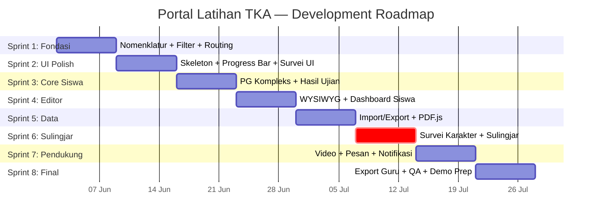

# 🗺️ Development Roadmap — Portal Latihan TKA (PWA)

**Konteks:** Aplikasi simulasi TKA untuk siswa kelas 6 SD  
**Stack:** React + Vite (Frontend), PHP (Backend), MySQL, Tailwind CSS  
**User Roles:** Admin, Guru, Siswa  
**Status Saat Ini:** Refactoring penamaan Bahasa Indonesia ✅ selesai, aplikasi menggunakan mock data

---

## Kondisi Proyek Saat Ini

Berdasarkan analisis kode:

| Aspek | Status |
|-------|--------|
| Refactoring folder/file → Bahasa Indonesia | ✅ Selesai |
| Frontend pages (31 halaman) | ✅ Sudah ada, menggunakan mock data |
| Komponen UI reusable (10+ komponen) | ✅ Sudah ada |
| Routing & auth guard | ✅ Sudah ada (mock localStorage) |
| Backend API | ❌ Belum ada (semua masih mock) |
| Database schema | ❌ Belum ada |
| PWA (service worker, manifest) | ❌ Belum diimplementasi |

> [!IMPORTANT]
> Semua data saat ini masih mock. Fitur-fitur di `refactoringv2.md` adalah **pembaruan UI/UX dan fungsionalitas** di atas fondasi yang sudah ada. Planning ini mengasumsikan backend API sudah ada atau akan dikembangkan paralel.

---

## Inventaris Fitur & Analisis Detail

### 🌐 GLOBAL (5 Fitur)

---

#### G1. Halaman Khusus Notifikasi

| Aspek | Detail |
|-------|--------|
| **Tujuan** | Halaman full-page untuk menampilkan seluruh notifikasi saat user klik "Lihat Semua" |
| **Prioritas** | 🟡 Sedang |
| **Kompleksitas** | 🟢 Mudah |
| **Tipe** | Frontend-heavy |
| **Dependency** | Komponen `DropdownNotifikasi.jsx` sudah ada di modul Siswa |
| **Risiko** | Rendah. Halaman statis, tidak ada logic kompleks |
| **Estimasi** | **2–3 hari** |
| **Detail** | Buat halaman baru + route, reuse data notifikasi, tambah pagination/filter, perlu diakses dari semua role (Admin, Guru, Siswa) |

---

#### G2. Loading Skeleton (Animasi Pemuatan)

| Aspek | Detail |
|-------|--------|
| **Tujuan** | Mengganti spinner konvensional dengan skeleton loading agar UI terasa lebih responsif |
| **Prioritas** | 🟡 Sedang |
| **Kompleksitas** | 🟢 Mudah |
| **Tipe** | Frontend-heavy |
| **Dependency** | Komponen [SkeletonMemuat.jsx](file:///d:/laragon/www/portal-latihan-tka-frontend/src/komponen/ui/SkeletonMemuat.jsx) sudah ada |
| **Risiko** | Rendah. Bisa diterapkan bertahap per halaman |
| **Estimasi** | **2–3 hari** (terapkan ke semua halaman utama) |
| **Detail** | Komponen skeleton sudah ada, tinggal buat variant untuk setiap tipe layout (tabel, card, form) lalu pasang di halaman-halaman yang butuh loading state |

---

#### G3. Preview Import/Export Data

| Aspek | Detail |
|-------|--------|
| **Tujuan** | Menampilkan preview data sebelum import soal (rincian jenis soal, jawaban, gambar) dan preview laporan sebelum export |
| **Prioritas** | 🔴 Tinggi |
| **Kompleksitas** | 🟡 Menengah |
| **Tipe** | Fullstack |
| **Dependency** | G4 (WYSIWYG Editor — untuk rendering soal di preview), komponen [ModalImpor](file:///d:/laragon/www/portal-latihan-tka-frontend/src/komponen/admin/BankSoal) sudah ada |
| **Risiko** | **Sedang.** Parsing Excel/CSV di client-side bisa gagal untuk format yang tidak standar. Perlu validasi data yang robust |
| **Estimasi** | **4–5 hari** |
| **Detail** | Import: gunakan FileReader API + library seperti SheetJS untuk parsing client-side. Export: buat preview modal sebelum generate PDF/Excel. Perlu handle edge case format file yang korup |

---

#### G4. WYSIWYG Editor untuk Soal

| Aspek | Detail |
|-------|--------|
| **Tujuan** | Mengganti form input soal biasa menjadi editor rich-text (mirip Word) untuk pertanyaan dan jawaban |
| **Prioritas** | 🔴 Tinggi |
| **Kompleksitas** | 🔴 Sulit |
| **Tipe** | Frontend-heavy |
| **Dependency** | Komponen [FormSoal.jsx](file:///d:/laragon/www/portal-latihan-tka-frontend/src/komponen/admin/FormSoal.jsx) (19KB) dan [EditorMatematikaVisual.jsx](file:///d:/laragon/www/portal-latihan-tka-frontend/src/komponen/admin/EditorMatematikaVisual.jsx) sudah ada |
| **Risiko** | **Tinggi.** Integrasi WYSIWYG (Quill.js/TinyMCE) dengan MathLive yang sudah ada bisa konflik. Sanitasi HTML output untuk keamanan. Output harus kompatibel dengan rendering soal di sisi siswa |
| **Estimasi** | **5–7 hari** |
| **Detail** | Integrasikan Quill.js atau TinyMCE, pastikan kompatibel dengan KaTeX/MathLive yang sudah dipakai. Perlu custom toolbar, image upload, dan sanitasi output. Ini adalah fitur yang paling berdampak pada kualitas soal |

---

#### G5. Lokalisasi Routing

| Aspek | Detail |
|-------|--------|
| **Tujuan** | Refactoring URL/routing dari bahasa Inggris ke Bahasa Indonesia |
| **Prioritas** | 🟡 Sedang |
| **Kompleksitas** | 🟢 Mudah |
| **Tipe** | Frontend-heavy |
| **Dependency** | [App.jsx](file:///d:/laragon/www/portal-latihan-tka-frontend/src/App.jsx) — semua route definition |
| **Risiko** | **Rendah–Sedang.** Harus update semua `useNavigate()` dan `<Link>` di seluruh app. Bisa ada broken link jika ada yang terlewat |
| **Estimasi** | **2–3 hari** |
| **Detail** | Ubah path: `/test` → `/ujian`, `/modules` → `/modul`, `/settings` → `/pengaturan`, dll. Gunakan global search-replace dengan verifikasi manual |

---

### 👔 MODUL ADMIN (8 Fitur)

---

#### A1. Filter Bank Soal (Hapus opsi "Semua")

| Aspek | Detail |
|-------|--------|
| **Tujuan** | Menghapus opsi filter "Semua" di bank soal, menyisakan hanya "Akademik" dan "Survei" |
| **Prioritas** | 🔴 Tinggi |
| **Kompleksitas** | 🟢 Mudah |
| **Tipe** | Frontend-heavy |
| **Dependency** | [BankSoal.jsx](file:///d:/laragon/www/portal-latihan-tka-frontend/src/admin/halaman/BankSoal.jsx) |
| **Risiko** | Rendah |
| **Estimasi** | **0.5 hari** |

---

#### A2. Filter Laporan Nilai (Hapus opsi "Survei")

| Aspek | Detail |
|-------|--------|
| **Tujuan** | Menghapus opsi "Survei" dari filter laporan nilai |
| **Prioritas** | 🔴 Tinggi |
| **Kompleksitas** | 🟢 Mudah |
| **Tipe** | Frontend-heavy |
| **Dependency** | [LaporanNilai.jsx](file:///d:/laragon/www/portal-latihan-tka-frontend/src/admin/halaman/LaporanNilai.jsx) |
| **Risiko** | Rendah |
| **Estimasi** | **0.5 hari** |

---

#### A3. Optimalisasi UI Laporan Survei

| Aspek | Detail |
|-------|--------|
| **Tujuan** | Mengecilkan tampilan agregat jawaban, perbaiki tabel siswa, perbaiki tombol aksi |
| **Prioritas** | 🟡 Sedang |
| **Kompleksitas** | 🟢 Mudah |
| **Tipe** | Frontend-heavy |
| **Dependency** | [LaporanSurveiAdmin.jsx](file:///d:/laragon/www/portal-latihan-tka-frontend/src/admin/halaman/LaporanSurveiAdmin.jsx) |
| **Risiko** | Rendah |
| **Estimasi** | **1–2 hari** |

---

#### A4. Perbaikan Tombol Dashboard

| Aspek | Detail |
|-------|--------|
| **Tujuan** | Card "Siswa Perlu Perhatian" dan "Log Aktivitas" harus bisa navigasi ke halaman yang sesuai |
| **Prioritas** | 🔴 Tinggi |
| **Kompleksitas** | 🟢 Mudah |
| **Tipe** | Frontend-heavy |
| **Dependency** | Komponen [dasbor/](file:///d:/laragon/www/portal-latihan-tka-frontend/src/komponen/admin/dasbor) (TabelSiswaPerhatian, LogAktivitas) |
| **Risiko** | Rendah |
| **Estimasi** | **0.5–1 hari** |

---

#### A5. Integrasi Sulingjar & Survei Karakter

| Aspek | Detail |
|-------|--------|
| **Tujuan** | Halaman pembuatan instrumen Survei Karakter dan Sulingjar (skala Likert) terintegrasi dengan simulasi TKA |
| **Prioritas** | 🔴 Tinggi |
| **Kompleksitas** | 🔴 Sulit |
| **Tipe** | **Fullstack + Database-heavy** |
| **Dependency** | Halaman survei siswa ([EksekusiSurvei.jsx](file:///d:/laragon/www/portal-latihan-tka-frontend/src/siswa/halaman/EksekusiSurvei.jsx), [SurveiSelesai.jsx](file:///d:/laragon/www/portal-latihan-tka-frontend/src/siswa/halaman/SurveiSelesai.jsx)) sudah ada. Tapi butuh skema DB baru untuk instrumen Likert yang berbeda dari soal akademik |
| **Risiko** | **Tinggi.** Ini fitur baru yang kompleks: (1) Skema DB harus polimorfik — survei karakter dan sulingjar punya struktur berbeda dari soal akademik, (2) Logic penilaian Likert berbeda total dari scoring TKA, (3) Perlu builder instrumen baru di admin, (4) Perlu integrasi dengan alur simulasi TKA yang sudah ada |
| **Estimasi** | **7–10 hari** |
| **Detail** | Ini adalah fitur terbesar dan paling kritis. Perlu: tabel DB baru, API baru, form builder survei di admin, renderer Likert di siswa, laporan agregat survei. Harus dipisahkan dari logic penilaian akademik |

---

#### A6. Penyederhanaan Mode Ujian (Hapus Latihan Mandiri dari Admin)

| Aspek | Detail |
|-------|--------|
| **Tujuan** | Admin hanya mengelola "Simulasi TKA", fitur "Latihan Mandiri" dihapus dari akses admin |
| **Prioritas** | 🔴 Tinggi |
| **Kompleksitas** | 🟢 Mudah |
| **Tipe** | Frontend-heavy |
| **Dependency** | [ManajemenTryout.jsx](file:///d:/laragon/www/portal-latihan-tka-frontend/src/admin/halaman/ManajemenTryout.jsx), [TambahTryout.jsx](file:///d:/laragon/www/portal-latihan-tka-frontend/src/admin/halaman/TambahTryout.jsx) |
| **Risiko** | **Rendah–Sedang.** Perlu pastikan latihan mandiri masih bisa dikelola guru |
| **Estimasi** | **1–2 hari** |

---

#### A7. Filter Periode Simulasi

| Aspek | Detail |
|-------|--------|
| **Tujuan** | Dropdown periode pada laporan nilai hanya menampilkan simulasi TKA yang sudah selesai |
| **Prioritas** | 🟡 Sedang |
| **Kompleksitas** | 🟢 Mudah |
| **Tipe** | Fullstack (perlu filter query dari backend) |
| **Dependency** | A6 (penyederhanaan mode ujian), [LaporanNilai.jsx](file:///d:/laragon/www/portal-latihan-tka-frontend/src/admin/halaman/LaporanNilai.jsx) |
| **Risiko** | Rendah |
| **Estimasi** | **1 hari** |

---

#### A8. Pembaruan Nomenklatur ("Tryout" → "Simulasi TKA")

| Aspek | Detail |
|-------|--------|
| **Tujuan** | Ubah semua label "Manajemen Tryout" → "Manajemen Simulasi TKA" di sidebar, heading, breadcrumb |
| **Prioritas** | 🔴 Tinggi |
| **Kompleksitas** | 🟢 Mudah |
| **Tipe** | Frontend-heavy |
| **Dependency** | Tidak ada |
| **Risiko** | Rendah. Search-replace sederhana |
| **Estimasi** | **0.5–1 hari** |

---

### 👩‍🏫 MODUL GURU (3 Fitur)

---

#### T1. Integrasi Pesan Langsung

| Aspek | Detail |
|-------|--------|
| **Tujuan** | Tombol "Hubungi" di daftar siswa langsung membuka fitur kirim pesan, bukan popup notifikasi |
| **Prioritas** | 🟡 Sedang |
| **Kompleksitas** | 🟡 Menengah |
| **Tipe** | Fullstack |
| **Dependency** | [DaftarSiswaGuru.jsx](file:///d:/laragon/www/portal-latihan-tka-frontend/src/guru/halaman/DaftarSiswaGuru.jsx). Butuh sistem messaging di backend |
| **Risiko** | **Sedang.** Jika sistem messaging belum ada di backend, ini menjadi fitur besar. Jika hanya redirect ke WhatsApp/email, jauh lebih sederhana |
| **Estimasi** | **2–4 hari** (tergantung scope messaging) |

---

#### T2. Opsi Export Laporan (PDF & Excel)

| Aspek | Detail |
|-------|--------|
| **Tujuan** | Customization opsi export: pilih kolom, format, filter data sebelum export |
| **Prioritas** | 🟡 Sedang |
| **Kompleksitas** | 🟡 Menengah |
| **Tipe** | Fullstack (backend: DomPDF, PhpSpreadsheet) |
| **Dependency** | G3 (Preview Import/Export), [LaporanNilaiGuru.jsx](file:///d:/laragon/www/portal-latihan-tka-frontend/src/guru/halaman/LaporanNilaiGuru.jsx) |
| **Risiko** | **Sedang.** Layout PDF bisa tricky untuk tabel yang panjang. Perlu testing format output yang konsisten |
| **Estimasi** | **3–4 hari** |

---

#### T3. Ringkasan Ujian (Scoped Access)

| Aspek | Detail |
|-------|--------|
| **Tujuan** | Tampilan ringkasan ujian mendatang yang disesuaikan dengan hak akses guru |
| **Prioritas** | 🟢 Rendah |
| **Kompleksitas** | 🟢 Mudah |
| **Tipe** | Frontend-heavy |
| **Dependency** | [DashboardGuru.jsx](file:///d:/laragon/www/portal-latihan-tka-frontend/src/guru/halaman/DashboardGuru.jsx) (27KB, sudah cukup besar) |
| **Risiko** | Rendah |
| **Estimasi** | **1–2 hari** |

---

### 🎒 MODUL SISWA (8 Fitur)

---

#### S1. Visibilitas Password (Eye Icon)

| Aspek | Detail |
|-------|--------|
| **Tujuan** | Tambah toggle show/hide password di form ganti password |
| **Prioritas** | 🟡 Sedang |
| **Kompleksitas** | 🟢 Mudah |
| **Tipe** | Frontend-heavy |
| **Dependency** | [PengaturanSiswa.jsx](file:///d:/laragon/www/portal-latihan-tka-frontend/src/siswa/halaman/PengaturanSiswa.jsx) |
| **Risiko** | Rendah |
| **Estimasi** | **0.5 hari** |

---

#### S2. Sistem Reminder Dashboard

| Aspek | Detail |
|-------|--------|
| **Tujuan** | Notifikasi besar di dashboard sebagai reminder, dengan tombol dismiss |
| **Prioritas** | 🟡 Sedang |
| **Kompleksitas** | 🟢 Mudah |
| **Tipe** | Frontend-heavy |
| **Dependency** | [DashboardSiswa.jsx](file:///d:/laragon/www/portal-latihan-tka-frontend/src/siswa/halaman/DashboardSiswa.jsx) |
| **Risiko** | Rendah |
| **Estimasi** | **1–2 hari** |

---

#### S3. Agenda Mendatang

| Aspek | Detail |
|-------|--------|
| **Tujuan** | Daftar jadwal simulasi/latihan mendatang di dashboard siswa |
| **Prioritas** | 🟡 Sedang |
| **Kompleksitas** | 🟢 Mudah |
| **Tipe** | Frontend-heavy (butuh data jadwal dari backend) |
| **Dependency** | [DashboardSiswa.jsx](file:///d:/laragon/www/portal-latihan-tka-frontend/src/siswa/halaman/DashboardSiswa.jsx), terkait dengan fitur agenda di guru |
| **Risiko** | Rendah |
| **Estimasi** | **1–2 hari** |

---

#### S4. Fleksibilitas Akses Modul Dokumen

| Aspek | Detail |
|-------|--------|
| **Tujuan** | Dua opsi: baca PDF langsung di browser (via PDF.js) atau download PDF |
| **Prioritas** | 🟡 Sedang |
| **Kompleksitas** | 🟡 Menengah |
| **Tipe** | Frontend-heavy |
| **Dependency** | [ModulSiswa.jsx](file:///d:/laragon/www/portal-latihan-tka-frontend/src/siswa/halaman/ModulSiswa.jsx) (18KB) |
| **Risiko** | **Sedang.** Integrasi PDF.js membutuhkan konfigurasi worker. File PDF besar bisa lambat di-render. Perlu fallback untuk browser yang tidak support |
| **Estimasi** | **3–4 hari** |

---

#### S5. Fleksibilitas Akses Modul Video

| Aspek | Detail |
|-------|--------|
| **Tujuan** | Dual video player: internal player untuk file upload, iframe/redirect untuk YouTube |
| **Prioritas** | 🟡 Sedang |
| **Kompleksitas** | 🟡 Menengah |
| **Tipe** | Frontend-heavy |
| **Dependency** | [ModulSiswa.jsx](file:///d:/laragon/www/portal-latihan-tka-frontend/src/siswa/halaman/ModulSiswa.jsx), S4 (modul dokumen — karena di halaman yang sama) |
| **Risiko** | **Sedang.** Deteksi URL YouTube vs file upload. Video player internal perlu handle berbagai format (mp4, webm). Bandwidth siswa yang terbatas |
| **Estimasi** | **2–3 hari** |

---

#### S6. Pembaruan UI Hasil Ujian

| Aspek | Detail |
|-------|--------|
| **Tujuan** | Layout hasil ujian yang berbeda untuk Simulasi TKA, Latihan Mandiri, dan Kuis |
| **Prioritas** | 🔴 Tinggi |
| **Kompleksitas** | 🟡 Menengah |
| **Tipe** | Frontend-heavy |
| **Dependency** | [HasilUjian.jsx](file:///d:/laragon/www/portal-latihan-tka-frontend/src/siswa/halaman/HasilUjian.jsx) (29KB — file terbesar di proyek) |
| **Risiko** | **Sedang.** File sudah sangat besar, perlu dipecah menjadi sub-komponen. Tiga layout berbeda berarti tiga set komponen |
| **Estimasi** | **3–5 hari** |
| **Detail** | Perlu refactor HasilUjian.jsx yang sudah 29KB menjadi komponen modular, lalu buat 3 variant layout |

---

#### S7. Revisi UI Simulasi (PG Kompleks)

| Aspek | Detail |
|-------|--------|
| **Tujuan** | Perbaikan layout pengerjaan soal, terutama untuk tipe PG kompleks/multi-jawaban dengan indikator jelas |
| **Prioritas** | 🔴 Tinggi |
| **Kompleksitas** | 🟡 Menengah |
| **Tipe** | Frontend-heavy |
| **Dependency** | [EksekusiUjian.jsx](file:///d:/laragon/www/portal-latihan-tka-frontend/src/siswa/halaman/EksekusiUjian.jsx), komponen [RendererSoal/](file:///d:/laragon/www/portal-latihan-tka-frontend/src/komponen/siswa/RendererSoal) (sudah ada renderer per tipe), [KartuOpsi.jsx](file:///d:/laragon/www/portal-latihan-tka-frontend/src/komponen/siswa/KartuOpsi.jsx) |
| **Risiko** | **Sedang.** Harus jelas bagi siswa kelas 6 SD bahwa soal bisa multi-jawaban. UX critical — salah desain bisa bikin siswa bingung |
| **Estimasi** | **2–3 hari** |

---

#### S8. Progress Bar Pembelajaran

| Aspek | Detail |
|-------|--------|
| **Tujuan** | Ubah "Kemampuan Akademik" → "Progres Aktivitas Belajar" dengan bar meter (10/14 Simulasi, 11/12 Modul) |
| **Prioritas** | 🟡 Sedang |
| **Kompleksitas** | 🟢 Mudah |
| **Tipe** | Frontend-heavy |
| **Dependency** | [DashboardSiswa.jsx](file:///d:/laragon/www/portal-latihan-tka-frontend/src/siswa/halaman/DashboardSiswa.jsx), komponen [WidgetProgres.jsx](file:///d:/laragon/www/portal-latihan-tka-frontend/src/komponen/siswa/Dasbor/WidgetProgres.jsx), [BarProgres.jsx](file:///d:/laragon/www/portal-latihan-tka-frontend/src/komponen/ui/BarProgres.jsx) |
| **Risiko** | Rendah. Komponen progress bar sudah ada |
| **Estimasi** | **1–2 hari** |

---

## 📊 Matriks Prioritas (Impact vs Effort)

```
        TINGGI IMPACT
             │
    A5       │  G4      S6
  (Sulingjar)│(WYSIWYG) (UI Hasil)
             │
             │  G3       S7
             │(Preview)  (PG Kompleks)
             │
 ────────────┼──────────────────────
  EFFORT     │           EFFORT
  RENDAH     │           TINGGI
             │
    A1,A2    │  T2       S4
    A8,A4    │(Export)   (PDF.js)
    S1,A6    │
             │  T1       S5
             │(Pesan)   (Video)
             │
        RENDAH IMPACT
```

---

## 🏃 Pembagian Sprint (8 Sprint × 1 Minggu)

### Sprint 1 — Fondasi & Quick Wins  
📅 **Minggu 1** | Focus: Stabilisasi & perubahan low-risk

#### Daftar Fitur

| # | Fitur | Est. | Tipe |
|---|-------|------|------|
| A8 | Pembaruan Nomenklatur "Tryout" → "Simulasi TKA" | 0.5–1 hari | Frontend |
| A1 | Filter Bank Soal (hapus "Semua") | 0.5 hari | Frontend |
| A2 | Filter Laporan Nilai (hapus "Survei") | 0.5 hari | Frontend |
| A4 | Perbaikan Tombol Dashboard Admin | 0.5–1 hari | Frontend |
| A6 | Penyederhanaan Mode Ujian | 1–2 hari | Frontend |
| S1 | Visibilitas Password (Eye Icon) | 0.5 hari | Frontend |
| G5 | Lokalisasi Routing | 2–3 hari | Frontend |

**Total estimasi:** 5–8 hari kerja (1 sprint padat)

#### Alasan Prioritas
- Semua fitur ini **low-risk, high-certainty**
- Menyelesaikan "housekeeping" sebelum fitur besar
- Nomenklatur dan filter harus konsisten dulu sebelum membangun fitur baru di atasnya
- Lokalisasi routing dilakukan di awal agar semua sprint berikutnya pakai URL baru

#### Target Hasil
- ✅ Semua label "Tryout" sudah menjadi "Simulasi TKA"
- ✅ Filter bank soal dan laporan sudah konsisten
- ✅ Dashboard admin navigable
- ✅ URL routing sudah berbahasa Indonesia
- ✅ Form ganti password sudah ada eye toggle

#### Risiko
- Lokalisasi routing bisa menimbulkan broken link → mitigasi: jalankan full navigation test setelah selesai

#### Checkpoint Testing
- [ ] Navigasi semua halaman admin tanpa error
- [ ] Navigasi semua halaman siswa tanpa error  
- [ ] Navigasi semua halaman guru tanpa error
- [ ] Semua label "Tryout" sudah berubah → grep `Tryout` = 0 match di UI
- [ ] `npm run build` sukses tanpa error

---

### Sprint 2 — UI Polish & Loading UX  
📅 **Minggu 2** | Focus: Pengalaman visual & responsivitas

#### Daftar Fitur

| # | Fitur | Est. | Tipe |
|---|-------|------|------|
| G2 | Loading Skeleton (semua halaman) | 2–3 hari | Frontend |
| A3 | Optimalisasi UI Laporan Survei | 1–2 hari | Frontend |
| S8 | Progress Bar Pembelajaran | 1–2 hari | Frontend |
| A7 | Filter Periode Simulasi | 1 hari | Fullstack |

**Total estimasi:** 5–8 hari kerja

#### Alasan Prioritas
- Loading skeleton meningkatkan **perceived performance** → kesan pertama lebih baik untuk demo
- Progress bar dan filter periode menggunakan komponen yang sudah ada, tinggal wiring
- UI laporan survei kecil tapi penting sebelum Sprint 3 (Sulingjar)

#### Target Hasil
- ✅ Semua halaman utama punya skeleton loading
- ✅ Dashboard siswa menampilkan progress belajar (bar meter)
- ✅ Laporan survei admin sudah lebih informatif
- ✅ Filter periode hanya menampilkan simulasi yang selesai

#### Risiko
- Skeleton harus konsisten di semua halaman → buat skeleton template yang reusable, jangan per-halaman

#### Checkpoint Testing
- [ ] Toggle loading state → skeleton muncul di semua halaman utama
- [ ] Dashboard siswa menampilkan progress bar dengan data mock
- [ ] Dropdown periode hanya menampilkan simulasi completed
- [ ] UI laporan survei lebih compact dan informatif

---

### Sprint 3 — Fitur Inti Siswa (Simulasi)  
📅 **Minggu 3** | Focus: Core exam experience

#### Daftar Fitur

| # | Fitur | Est. | Tipe |
|---|-------|------|------|
| S7 | Revisi UI Simulasi (PG Kompleks) | 2–3 hari | Frontend |
| S6 | Pembaruan UI Hasil Ujian | 3–5 hari | Frontend |

**Total estimasi:** 5–8 hari kerja

#### Alasan Prioritas
- **Ini adalah core feature aplikasi** — pengalaman mengerjakan soal dan melihat hasil
- Siswa kelas 6 SD harus bisa memahami soal PG kompleks tanpa bingung
- HasilUjian.jsx (29KB) perlu di-refactor sebelum menambah 3 layout variant
- Sprint ini sengaja hanya 2 fitur besar karena kompleksitasnya tinggi

#### Target Hasil
- ✅ Soal PG kompleks punya indikator visual "Pilih lebih dari satu jawaban"
- ✅ Layout hasil ujian berbeda untuk Simulasi TKA, Latihan Mandiri, dan Kuis
- ✅ HasilUjian.jsx sudah di-refactor menjadi komponen modular

#### Risiko
- HasilUjian.jsx sangat besar (29KB) → refactor bisa introduce bug
- UX untuk anak SD harus diuji — minta feedback dari calon user jika memungkinkan

#### Checkpoint Testing
- [ ] Soal PG kompleks menampilkan badge "Pilihan Ganda Kompleks"
- [ ] Checkbox (bukan radio) untuk soal multi-answer
- [ ] 3 layout hasil ujian ditampilkan sesuai tipe aktivitas
- [ ] Regression test: soal PG biasa, Benar/Salah, Esai masih berfungsi
- [ ] `npm run build` sukses

---

### Sprint 4 — WYSIWYG Editor & Dashboard Siswa  
📅 **Minggu 4** | Focus: Content creation & student dashboard

#### Daftar Fitur

| # | Fitur | Est. | Tipe |
|---|-------|------|------|
| G4 | WYSIWYG Editor untuk Soal | 5–7 hari | Frontend |
| S2 | Sistem Reminder Dashboard | 1–2 hari | Frontend |
| S3 | Agenda Mendatang | 1–2 hari | Frontend |

**Total estimasi:** 7–11 hari kerja (sprint bisa overflow)

#### Alasan Prioritas
- WYSIWYG editor adalah **prerequisite** untuk G3 (Preview Import/Export) dan meningkatkan kualitas soal
- S2 dan S3 adalah fitur dashboard yang ringan, bisa dikerjakan paralel saat WYSIWYG butuh testing

#### Target Hasil
- ✅ Form input soal menggunakan rich-text editor (bold, italic, list, image, formula matematika)
- ✅ Output WYSIWYG kompatibel dengan renderer soal di sisi siswa
- ✅ Dashboard siswa menampilkan reminder + agenda mendatang

#### Risiko
- **WYSIWYG + MathLive integration adalah risiko tertinggi** di seluruh proyek
- Jika integrasi gagal, fallback ke enhanced textarea dengan markdown support

> [!WARNING]
> Sprint ini berpotensi overflow. Jika WYSIWYG memakan waktu lebih dari 5 hari, pindahkan S2+S3 ke Sprint 5 dan jangan dipaksakan.

#### Checkpoint Testing
- [ ] Editor bisa: bold, italic, underline, list, insert image
- [ ] Editor bisa insert formula matematika (KaTeX)
- [ ] Soal yang dibuat via WYSIWYG ter-render dengan benar di sisi siswa
- [ ] Reminder muncul dan bisa di-dismiss
- [ ] Agenda menampilkan jadwal mendatang

---

### Sprint 5 — Import/Export & Modul Pembelajaran  
📅 **Minggu 5** | Focus: Data portability & content delivery

#### Daftar Fitur

| # | Fitur | Est. | Tipe |
|---|-------|------|------|
| G3 | Preview Import/Export Data | 4–5 hari | Fullstack |
| S4 | Fleksibilitas Akses Modul Dokumen (PDF.js) | 3–4 hari | Frontend |

**Total estimasi:** 7–9 hari kerja

#### Alasan Prioritas
- Import/Export dengan preview adalah fitur krusial untuk guru/admin yang mengelola banyak soal
- PDF.js untuk modul siswa meningkatkan aksesibilitas — tidak perlu download untuk baca materi
- Kedua fitur ini independent satu sama lain → bisa paralel

#### Target Hasil
- ✅ Import soal via Excel/CSV menampilkan preview sebelum submit
- ✅ Export laporan menampilkan preview sebelum download
- ✅ Siswa bisa baca PDF langsung di browser atau download

#### Risiko
- Parsing Excel di client-side bisa gagal untuk format non-standar
- PDF.js worker configuration bisa tricky di PWA

#### Checkpoint Testing
- [ ] Upload file Excel → tampil preview tabel soal + jawaban
- [ ] Preview export laporan → download PDF/Excel sesuai pilihan
- [ ] PDF modul bisa dibaca in-browser tanpa download
- [ ] Tombol download PDF tetap berfungsi
- [ ] File Excel yang korup ditangani gracefully (error message)

---

### Sprint 6 — Sulingjar, Survei Karakter & Video  
📅 **Minggu 6** | Focus: Instrumen evaluasi tambahan

#### Daftar Fitur

| # | Fitur | Est. | Tipe |
|---|-------|------|------|
| A5 | Integrasi Sulingjar & Survei Karakter | 7–10 hari | Fullstack + DB |

**Total estimasi:** 7–10 hari kerja (sprint penuh untuk 1 fitur)

#### Alasan Prioritas
- **Fitur terbesar dan paling kompleks** di seluruh dokumen
- Sprint penuh dialokasikan karena mencakup: DB schema baru, API baru, builder instrumen, renderer Likert, dan laporan agregat
- Semua fitur prerequisite (filter, nomenklatur, UI survei) sudah selesai di sprint sebelumnya

#### Target Hasil
- ✅ Admin bisa membuat instrumen Survei Karakter (skala Likert)
- ✅ Admin bisa membuat instrumen Sulingjar (skala Likert)
- ✅ Siswa bisa mengerjakan survei karakter
- ✅ Laporan agregat survei tersedia di admin & guru

#### Risiko
- **Risiko tertinggi di seluruh proyek.** Schema DB harus didesain dengan hati-hati
- Logic Likert scoring berbeda total dari scoring TKA → jangan gabungkan
- Jika waktu tidak cukup, fokus Survei Karakter dulu, Sulingjar di sprint berikutnya

> [!CAUTION]
> Jika backend belum siap untuk fitur ini, Sprint 6 bisa diisi dengan S5 (Video) + T1 (Pesan) + T3 (Ringkasan Ujian) sebagai buffer. Jangan memaksakan Sulingjar tanpa backend.

#### Checkpoint Testing
- [ ] Admin bisa create instrumen survei dengan pertanyaan skala Likert
- [ ] Siswa bisa mengerjakan survei karakter end-to-end
- [ ] Hasil survei muncul di laporan admin
- [ ] Scoring Likert terpisah dari scoring akademik
- [ ] Data survei tersimpan dengan benar di database

---

### Sprint 7 — Video, Pesan & Polish  
📅 **Minggu 7** | Focus: Fitur pendukung & refinement

#### Daftar Fitur

| # | Fitur | Est. | Tipe |
|---|-------|------|------|
| S5 | Fleksibilitas Akses Modul Video | 2–3 hari | Frontend |
| T1 | Integrasi Pesan Langsung | 2–4 hari | Fullstack |
| T3 | Ringkasan Ujian (Scoped Access) | 1–2 hari | Frontend |
| G1 | Halaman Khusus Notifikasi | 2–3 hari | Frontend |

**Total estimasi:** 7–12 hari kerja

#### Alasan Prioritas
- Semua fitur inti sudah selesai, sprint ini mengisi fitur pendukung
- Video player dan messaging meningkatkan kelengkapan fitur
- Notifikasi halaman full-page melengkapi UX

#### Target Hasil
- ✅ Video YouTube dan upload bisa diputar di modul siswa
- ✅ Guru bisa kirim pesan langsung ke siswa
- ✅ Dashboard guru menampilkan ringkasan ujian mendatang
- ✅ Halaman notifikasi full-page berfungsi untuk semua role

#### Risiko
- T1 (Pesan) scope bisa membengkak jika jadi full messaging system → batasi scope: guru → siswa one-way only

#### Checkpoint Testing
- [ ] Video YouTube ter-embed dengan benar via iframe
- [ ] Video upload bisa diputar dengan HTML5 video player
- [ ] Guru bisa kirim pesan, siswa terima notifikasi
- [ ] Ringkasan ujian di dashboard guru sesuai hak akses
- [ ] Halaman notifikasi menampilkan history dari semua role

---

### Sprint 8 — Export Guru, QA & Demo Prep  
📅 **Minggu 8** | Focus: Polish, testing, dan persiapan demo

#### Daftar Fitur

| # | Fitur | Est. | Tipe |
|---|-------|------|------|
| T2 | Opsi Export Laporan (PDF & Excel) | 3–4 hari | Fullstack |
| — | Bug fixing & regression testing | 2–3 hari | All |
| — | Demo preparation & documentation | 1–2 hari | — |

**Total estimasi:** 6–9 hari kerja

#### Alasan Prioritas
- Export adalah fitur terakhir yang butuh backend
- Sisa waktu digunakan untuk QA menyeluruh
- Demo prep penting untuk capstone

#### Target Hasil
- ✅ Guru bisa export laporan ke PDF/Excel dengan customization
- ✅ Semua bug critical sudah diperbaiki
- ✅ Demo flow sudah disiapkan dan diuji

#### Checkpoint Testing
- [ ] Export PDF dengan layout yang rapi
- [ ] Export Excel dengan kolom yang sesuai pilihan
- [ ] Full end-to-end test: Login → Dashboard → Simulasi → Hasil → Laporan
- [ ] PWA manifest & service worker berfungsi (jika sudah diimplementasi)
- [ ] `npm run build` production-ready

---

## 🏆 Rekomendasi MVP (Minimum Viable Product)

Fitur yang **HARUS** ada untuk demo/capstone:

| # | Fitur | Sprint | Alasan |
|---|-------|--------|--------|
| A8 | Nomenklatur "Simulasi TKA" | 1 | Konsistensi identitas produk |
| A1, A2 | Filter yang benar | 1 | Menunjukkan data governance |
| S7 | UI Simulasi PG Kompleks | 3 | **Core feature** — ini yang membedakan app ini |
| S6 | UI Hasil Ujian per tipe | 3 | Menunjukkan kedalaman fitur |
| G4 | WYSIWYG Editor | 4 | Menunjukkan kualitas content creation |
| G3 | Preview Import/Export | 5 | Menunjukkan data management maturity |
| A5 | Sulingjar & Survei Karakter | 6 | **Differentiator** — fitur unik TKA |

> [!TIP]
> Untuk demo capstone, jalankan alur: **Admin buat soal (WYSIWYG) → Admin buat simulasi → Siswa kerjakan simulasi (PG kompleks) → Siswa lihat hasil → Guru lihat laporan → Export PDF.** Ini menunjukkan full lifecycle aplikasi.

---

## ⏸️ Fitur yang Sebaiknya Ditunda (Post-MVP)

| Fitur | Alasan Ditunda |
|-------|----------------|
| G1 — Halaman Notifikasi Full | Nice-to-have, dropdown sudah cukup untuk demo |
| T3 — Ringkasan Ujian Guru | Value rendah, bisa ditambahkan post-launch |
| S1 — Eye Icon Password | Bisa dikerjakan kapan saja, sangat trivial |

---

## ⚠️ Fitur yang Berpotensi Memakan Waktu Besar

| Fitur | Estimasi | Penyebab |
|-------|----------|----------|
| **A5 — Sulingjar & Survei Karakter** | 7–10 hari | Schema DB baru, logic scoring berbeda, builder instrumen baru |
| **G4 — WYSIWYG Editor** | 5–7 hari | Integrasi dengan MathLive, sanitasi HTML, kompatibilitas rendering |
| **S6 — UI Hasil Ujian** | 3–5 hari | Refactor file 29KB + 3 layout variant |
| **G3 — Preview Import/Export** | 4–5 hari | Parsing client-side + preview UI + error handling |

---

## 🎓 Fitur Paling Penting untuk Demo/Capstone

Urutkan demo berdasarkan **wow factor**:

1. 🥇 **Simulasi TKA end-to-end** (S7 + S6) — Siswa mengerjakan soal PG kompleks → lihat hasil terstruktur
2. 🥈 **WYSIWYG Editor** (G4) — Admin membuat soal rich-text dengan formula matematika
3. 🥉 **Sulingjar & Survei Karakter** (A5) — Menunjukkan fitur unik yang tidak ada di app lain
4. 🏅 **Import/Export dengan Preview** (G3) — Menunjukkan data management yang mature
5. 🏅 **Progress Bar Pembelajaran** (S8) — Gamifikasi yang menarik secara visual

---

## 📋 Ringkasan Timeline



---

## User Review Required

> [!IMPORTANT]
> **Apakah backend API sudah tersedia?** Planning ini mengasumsikan fitur backend dikembangkan secara paralel. Jika backend belum ada sama sekali, Sprint 5–6 (Import/Export, Sulingjar) perlu disesuaikan menjadi mock-first, dengan backend integration sebagai sprint terpisah.

> [!IMPORTANT]
> **Scope Pesan Langsung (T1):** Apakah "pesan langsung" berarti in-app messaging (butuh tabel messages, real-time), atau cukup redirect ke WhatsApp/email? Ini sangat mempengaruhi estimasi (2 hari vs 7+ hari).

> [!IMPORTANT]
> **Target demo/capstone kapan?** Timeline di atas mencakup 8 minggu. Jika target demo lebih awal, fitur harus diprioritaskan ulang — fokus Sprint 1–4 (MVP) dan tunda Sprint 5–8.

