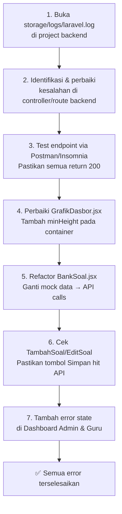

# Perencanaan Perbaikan Error — Portal Latihan TKA Frontend

> Dibuat: 15 Juni 2026 | Sumber: `log_error.md`

---

## Ringkasan Masalah

Terdapat **3 kategori error utama** yang ditemukan dari log browser:

| # | Kategori | File Terdampak | Prioritas |
|---|----------|---------------|-----------|
| 1 | API Backend Error `500` — `/admin/dashboard` | `DashboardAdmin.jsx` | 🔴 Kritis |
| 2 | API Backend Error `500` — endpoint-endpoint Guru | `DashboardGuru`, `AgendaKelas`, `DaftarSiswaGuru`, `LaporanNilaiGuru`, `KelolaModulGuru` | 🔴 Kritis |
| 3 | Recharts width/height warning `-1` | `GrafikDasbor.jsx` (line 47 & 97) | 🟡 Medium |
| 4 | Fitur CRUD Admin & Guru tidak berfungsi (hanya popup, tidak tersimpan) | `BankSoal.jsx` + halaman guru lainnya | 🔴 Kritis |

---

## Analisis Detail Per Error

### 🔴 Error 1 — HTTP 500 pada `/api/admin/dashboard`

**Log:**
```
DashboardAdmin.jsx:57  GET http://localhost:8000/api/admin/dashboard 500 (Internal Server Error)
AxiosError: Request failed with status code 500
  at async fetchData (DashboardAdmin.jsx:56:35)
```

**Penyebab kemungkinan (Backend):**
- Controller Laravel untuk `/admin/dashboard` crash (exception tidak tertangani)
- Query database gagal — relasi yang salah, kolom tidak ditemukan, atau tabel belum ada
- Middleware autentikasi/otorisasi gagal sebelum logika controller berjalan

**Dampak pada Frontend:**
- `DashboardAdmin.jsx` menampilkan data fallback statis (hardcoded)
- Chart `PerformanceTrendChart` dan `ClassComparisonChart` merender dengan data kosong
- `ActivityLog` kosong

---

### 🔴 Error 2 — HTTP 500 pada endpoint-endpoint Guru

**Log:**
```
GET http://localhost:8000/api/guru/siswa 500 (Internal Server Error)
  → AgendaKelas.jsx:45
  → DaftarSiswaGuru.jsx:45
  → LaporanNilaiGuru.jsx:65

GET http://localhost:8000/api/guru/modul 500 (Internal Server Error)
  → KelolaModulGuru.jsx:31

AxiosError: Request failed with status code 500
  at async getDaftarSiswaGuru (apiGuru.js:9:22)
  at async fetchData (DashboardGuru.jsx:33:42)
```

**Endpoint bermasalah:**
- `GET /api/guru/siswa`
- `GET /api/guru/modul`
- `GET /api/guru/dashboard` (tersirat dari DashboardGuru.jsx:42)

**Penyebab kemungkinan (Backend):**
- Controller Guru tidak terdaftar dengan benar di `routes/api.php`
- Method yang di-call belum diimplementasikan di controller
- Relasi Eloquent tidak ditemukan (misal: `guru->kelas->siswa` jika kolom/relasi belum ada)
- Middleware `auth:sanctum` gagal karena token tidak terkirim / Sanctum belum dikonfigurasi

---

### 🟡 Error 3 — Recharts Width/Height Warning

**Log:**
```
GrafikDasbor.jsx:47  The width(-1) and height(-1) of chart should be greater than 0,
  please check the style of container, or the props width(100%) and height(100%)
```

**Penyebab:**
- Container chart belum memiliki dimensi yang terdefinisi saat komponen pertama kali di-render
- `<div className="h-full w-full">` yang membungkus chart tidak memiliki tinggi eksplisit dari parent
- Recharts merender sebelum container terhitung ukurannya oleh browser (timing issue)

**Lokasi kode (DashboardAdmin.jsx):**
```jsx
// Baris 142 & 194
<div className="h-full w-full">
  <PerformanceTrendChart data={...} />
</div>
```

---

### 🔴 Error 4 — Fitur CRUD Tidak Tersimpan ke Database

**Deskripsi dari log:**
> "kegiatan crud di halaman admin dan guru masih belum terealisasikan / belum berfungsi, contohnya ketika saya membuat soal, setelah mengisi form soal saya klik tombol simpan, hanya muncul popup notif saja tapi tidak tersimpan di tabel bank soal."

**Akar masalah di `BankSoal.jsx`:**
- Komponen saat ini menggunakan **data mock** (`mockQuestionBank`) dari `@/data/mockSoal`
- Semua operasi CRUD (tambah, hapus) **hanya memanipulasi state lokal**, tidak memanggil API
- Tidak ada integrasi `api.post()` / `api.delete()` di BankSoal.jsx

```jsx
// BankSoal.jsx baris 43
const [questions, setQuestions] = useState(mockQuestionBank); // ← mock data, bukan dari API

// handleDelete baris 135 — hanya mengubah state, tidak hit API
const handleDelete = () => {
  setQuestions(prev => prev?.filter(q => !selectedIds.includes(q?.id)));
  toast.success(`${selectedIds.length} soal berhasil dihapus`); // ← notifikasi muncul tapi data tidak ke DB
};
```

---

## Rencana Perbaikan

---

### Langkah 1 — Debug & Perbaiki Backend (Prioritas Utama)

> [!IMPORTANT]
> Error 500 **harus diselesaikan di sisi backend** terlebih dahulu. Frontend tidak bisa berjalan normal sebelum backend berfungsi.

**Tindakan yang perlu dilakukan pada project Laravel (`portal-latihan-tka-backend`):**

#### 1.1 — Cek log Laravel
```bash
php artisan serve
# Buka storage/logs/laravel.log untuk melihat stack trace error sebenarnya
tail -f storage/logs/laravel.log
```

#### 1.2 — Pastikan route terdaftar
```bash
php artisan route:list | grep admin/dashboard
php artisan route:list | grep guru/siswa
php artisan route:list | grep guru/modul
```

#### 1.3 — Pastikan migrasi database sudah dijalankan
```bash
php artisan migrate:status
php artisan migrate
```

#### 1.4 — Pastikan Sanctum dikonfigurasi dan token valid
```bash
# Di file .env backend:
SANCTUM_STATEFUL_DOMAINS=localhost:5173
SESSION_DRIVER=cookie
```

---

### Langkah 2 — Perbaiki Error Recharts (Frontend)

**File:** [GrafikDasbor.jsx](file:///d:/laragon/www/portal-latihan-tka-frontend/src/komponen/admin/dashboard/GrafikDasbor.jsx)

**Solusi:** Tambahkan `min-h` eksplisit pada container, atau gunakan `ResponsiveContainer` dengan `aspect` ratio sebagai fallback.

#### Sebelum (bermasalah):
```jsx
<div className="h-full w-full">
  <PerformanceTrendChart data={...} />
</div>
```

#### Sesudah (diperbaiki):
```jsx
<div className="h-full w-full" style={{ minHeight: '300px' }}>
  <PerformanceTrendChart data={...} />
</div>
```

**Atau di dalam komponen GrafikDasbor.jsx**, pastikan `ResponsiveContainer` diberi `height` eksplisit:
```jsx
// Baris 47
<ResponsiveContainer width="100%" height={300}>  {/* ← ganti height="100%" dengan angka eksplisit */}
  ...
</ResponsiveContainer>
```

---

### Langkah 3 — Integrasi API Real pada BankSoal (Frontend)

**File:** [BankSoal.jsx](file:///d:/laragon/www/portal-latihan-tka-frontend/src/admin/halaman/BankSoal.jsx)

**Perubahan yang diperlukan:**

#### 3.1 — Tambah `useEffect` untuk fetch soal dari API
```jsx
// Ganti:
const [questions, setQuestions] = useState(mockQuestionBank);

// Menjadi:
const [questions, setQuestions] = useState([]);
const [isLoading, setIsLoading] = useState(true);

useEffect(() => {
  const fetchSoal = async () => {
    try {
      const res = await api.get('/admin/soal');
      setQuestions(res.data.data || []);
    } catch (err) {
      toast.error('Gagal memuat data soal');
    } finally {
      setIsLoading(false);
    }
  };
  fetchSoal();
}, []);
```

#### 3.2 — Perbaiki `handleDelete` agar hit API
```jsx
const handleDelete = async () => {
  try {
    if (deleteConfirmId === 'bulk') {
      await api.delete('/admin/soal/bulk', { data: { ids: selectedIds } });
      setQuestions(prev => prev.filter(q => !selectedIds.includes(q.id)));
      toast.success(`${selectedIds.length} soal berhasil dihapus`);
      setSelectedIds([]);
    } else {
      await api.delete(`/admin/soal/${deleteConfirmId}`);
      setQuestions(prev => prev.filter(q => q.id !== deleteConfirmId));
      toast.success('Soal berhasil dihapus');
    }
  } catch (err) {
    toast.error('Gagal menghapus soal');
  } finally {
    setDeleteConfirmId(null);
  }
};
```

#### 3.3 — Pastikan halaman TambahSoal / EditSoal hit API saat simpan
> File terkait: `TambahKuisGuru.jsx`, `TambahLatihanGuru.jsx`, `TambahModulGuru.jsx`
> Periksa apakah tombol "Simpan" memanggil `api.post()` atau hanya memanggil `toast.success()` saja.

---

### Langkah 4 — Tambah Error Handling Lebih Informatif

**File:** [DashboardAdmin.jsx](file:///d:/laragon/www/portal-latihan-tka-frontend/src/admin/halaman/DashboardAdmin.jsx) & [DashboardGuru.jsx](file:///d:/laragon/www/portal-latihan-tka-frontend/src/guru/halaman/DashboardGuru.jsx)

Tambahkan state `error` dan tampilkan pesan ke user:

```jsx
const [error, setError] = useState(null);

// Di dalam catch block:
catch (err) {
  console.error('Error fetching admin dashboard', err);
  setError('Gagal memuat data. Silakan refresh halaman atau hubungi administrator.');
}

// Di dalam render:
{error && (
  <div className="p-4 bg-red-50 border border-red-200 rounded-2xl text-red-600 text-sm">
    ⚠️ {error}
  </div>
)}
```

---

## Urutan Pengerjaan yang Disarankan



---

## File yang Perlu Dimodifikasi

### Frontend (`portal-latihan-tka-frontend`)

| File | Perubahan |
|------|-----------|
| [GrafikDasbor.jsx](file:///d:/laragon/www/portal-latihan-tka-frontend/src/komponen/admin/dashboard/GrafikDasbor.jsx) | Ganti `height="100%"` dengan nilai eksplisit (misal `300`) di `ResponsiveContainer` |
| [DashboardAdmin.jsx](file:///d:/laragon/www/portal-latihan-tka-frontend/src/admin/halaman/DashboardAdmin.jsx) | Tambah state `error`, tambah UI error state, perbaiki container chart |
| [DashboardGuru.jsx](file:///d:/laragon/www/portal-latihan-tka-frontend/src/guru/halaman/DashboardGuru.jsx) | Tambah state `error`, tampilkan error ke user |
| [BankSoal.jsx](file:///d:/laragon/www/portal-latihan-tka-frontend/src/admin/halaman/BankSoal.jsx) | Ganti mock data dengan API call, perbaiki CRUD agar hit endpoint backend |
| `TambahKuisGuru.jsx` | Verifikasi tombol simpan memanggil `api.post()` |
| `TambahModulGuru.jsx` | Verifikasi tombol simpan memanggil `api.post()` |
| `TambahLatihanGuru.jsx` | Verifikasi tombol simpan memanggil `api.post()` |

### Backend (`portal-latihan-tka-backend`)
| Yang Perlu Dicek | Keterangan |
|-----------------|------------|
| `routes/api.php` | Pastikan semua route `/admin/*` dan `/guru/*` terdaftar |
| `AdminDashboardController` | Periksa method `index()`, tangani exception |
| `GuruController` | Periksa method `siswa()`, `modul()`, `dashboard()` |
| `database/migrations` | Pastikan semua tabel terbuat (`php artisan migrate`) |
| `.env` | Pastikan `DB_*`, `SANCTUM_*` sudah dikonfigurasi |

---

> [!NOTE]
> Semua error 500 yang muncul **berasal dari sisi backend**. Frontend sudah menangani error dengan benar melalui `catch` block — hanya saja tidak menampilkan pesan error ke user (hanya `console.error`). Prioritas utama adalah memperbaiki backend terlebih dahulu.

> [!TIP]
> Gunakan **Postman** atau **Thunder Client (VS Code extension)** untuk menguji setiap endpoint API secara terpisah sebelum mengujinya dari frontend. Ini mempercepat proses debugging secara signifikan.
